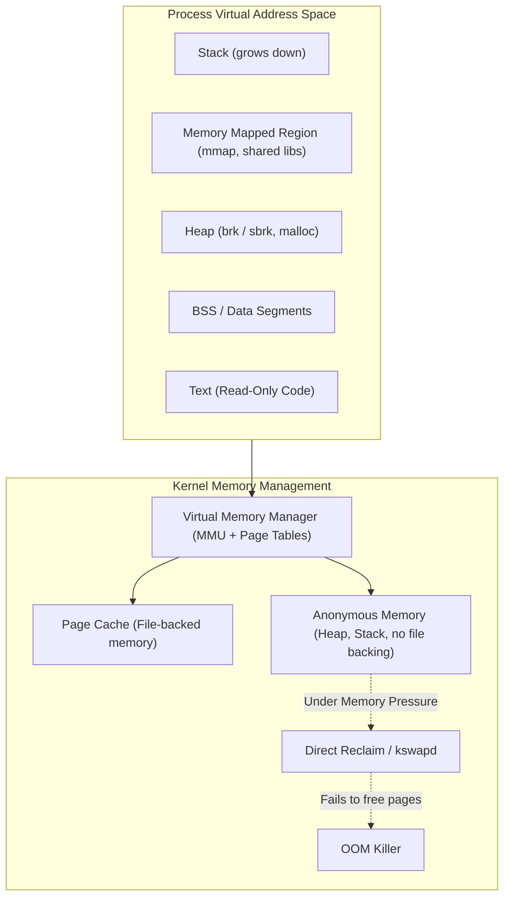

# 🐧 Linux Kernel, Memory, CPU & I/O Deep Dive

> **Senior/Staff Interview Scope**: Linux kernel subsystems, virtual memory architecture, page cache dirty pages, OOM killer calculation, cgroups v2 vs v1, CPU CFS throttling, and I/O schedulers.

---

## 1. Linux Virtual Memory & The Page Cache

### Key Concepts for Interviews
1. **Virtual Memory vs RSS (Resident Set Size)**:
   - **VSZ (Virtual Size)**: Total memory mapped by the process (including allocated but uncommitted memory and shared libraries).
   - **RSS (Resident Set Size)**: Physical RAM currently allocated and held in memory for the process.
   - **PSS (Proportional Set Size)**: RSS with shared libraries divided by the number of sharing processes.
2. **Page Cache & Dirty Pages**:
   - Linux aggressively uses free RAM as Page Cache for disk I/O caching.
   - `vm.dirty_background_ratio` / `vm.dirty_background_bytes`: Threshold where `kswapd` / flusher threads start background flushing to disk.
   - `vm.dirty_ratio` / `vm.dirty_bytes`: Hard threshold where writes block synchronously until flushed to disk (causes severe latency spikes in databases).
3. **The Out-Of-Memory (OOM) Killer**:
   - Invoked when the kernel fails to allocate a physical page during direct reclaim.
   - Computes an `oom_score` for all processes:
     $$\text{oom\_score} \approx \left(\frac{\text{RSS pages}}{\text{Total RAM}}\right) \times 1000 + \text{oom\_score\_adj}$$
   - `oom_score_adj`: Ranges from `-1000` (immune to OOM, e.g., sshd/kubelet) to `+1000` (first to be killed, e.g., batch jobs).

---

## 2. Linux Control Groups (cgroups v1 vs cgroups v2)

| Dimension | cgroups v1 | cgroups v2 (Unified Hierarchy) |
|---|---|---|
| **Hierarchy** | Multiple disparate trees per controller (`/sys/fs/cgroup/cpu`, `/sys/fs/cgroup/memory`) | Single unified tree (`/sys/fs/cgroup/`) |
| **Controller Interactions** | Broken interaction between memory and block I/O (buffered I/O was charged to root!) | Page cache writes are properly charged to the originating cgroup |
| **Pressure Stall Information (PSI)** | Not supported | Full support for CPU, Memory, and I/O pressure metrics (`/proc/pressure/*`) |
| **Memory Throttling** | Hard kill on memory limit | `memory.high` (throttles & reclaims before OOM) and `memory.max` (hard OOM limit) |

---

## 3. CPU Scheduling & CFS Bandwidth Throttling in Containers

- **CFS (Completely Fair Scheduler)**:
  - In Kubernetes, `resources.limits.cpu: "2"` translates to CFS quota and period:
    - `cpu.cfs_period_us = 100000` (100ms)
    - `cpu.cfs_quota_us = 200000` (200ms quota per 100ms window)
- **The CFS Throttling Trap**:
  - If a multi-threaded application (e.g., Node.js or Java with 8 worker threads) consumes its 200ms quota in the first 25ms of the period, the kernel **freezes all threads for the remaining 75ms**, creating severe P99 latency spikes despite low overall average CPU utilization.
  - **Resolution**: Tune `cpu.cfs_period_us` or eliminate CPU limits while keeping generous CPU requests in Kubernetes, or use eBPF/PSI metrics to monitor `nr_throttled`.

---

## 4. Linux I/O Schedulers & Kernel Buffers

- **I/O Schedulers**:
  - `none / noop`: Best for ultra-fast NVMe SSDs where hardware handles queuing.
  - `mq-deadline`: Default for high-performance enterprise storage.
  - `bfq`: Prioritizes interactive tasks on slow spinning disks.
- **Context Switches & Load Average**:
  - Linux Load Average counts both **Runnable tasks (R state)** AND **Uninterruptible sleep tasks (D state, usually disk/NFS I/O or kernel locks)**.
  - High Load Average + Low CPU Utilization = **Disk I/O bottleneck, slow NFS, or kernel lock contention**.

---

## 🎯 Top Senior Interview Questions & Model Answers

### Q1: "A container in Kubernetes has 4GB memory limit and crashes with Exit Code 137. How do you distinguish between an Application OOM vs Kernel OOM, and how do you debug it?"
> **Answer**:
> 1. Exit code `137` = `128 + 9` (SIGKILL). An OOM kill triggers `SIGKILL`.
> 2. Run `dmesg -T | grep -i oom` or inspect `journalctl -k`. The kernel prints the exact memory cgroup that exceeded `memory.max` or `memory.limit_in_bytes`, along with RSS, PageCache, and memory map dump of the victim process.
> 3. Check `kubectl describe pod` -> `Last State: Terminated: OOMKilled: true`.
> 4. To diagnose: Inspect whether the leak was in Anonymous memory (heap leak / goroutine leak) or Page Cache (unbuffered disk reads/writes). If anonymous memory climbs linearly, attach profilers (`pprof` for Go, memory heap dumps for JVM, `valgrind` / `jemalloc` for C/Rust).

### Q2: "Why can an application experience high P99 latency spikes when CPU utilization is only 30% inside a container?"
> **Answer**:
> This is classic **CFS Quota Throttling**. Even if average CPU over a 1-minute Prometheus scrape interval is 30%, within individual 100ms CFS periods (`cpu.cfs_period_us`), multi-threaded spikes can exhaust the burst quota (`cpu.cfs_quota_us`) in 10-20ms. The kernel deschedules all threads for the remaining 80ms of every period. We verify this by inspecting `/sys/fs/cgroup/cpu/cpu.stat` (`nr_throttled` and `throttled_time`).
