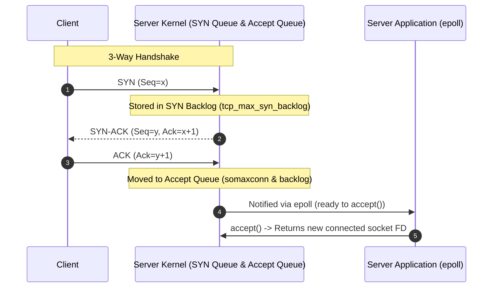
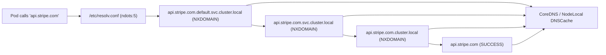

# 🌐 Linux Networking: TCP/IP Stack, Sockets, DNS & eBPF

> **Senior/Staff Interview Scope**: TCP handshake & teardown state machines, socket queue depths (`listen` backlog, `syn_backlog`), ephemeral port exhaustion, MTU/MSS & PMTUD, conntrack table saturation, DNS resolution chains (ndots, CoreDNS), and eBPF/XDP network acceleration.

---

## 1. The TCP State Machine & Kernel Queues

### Critical Socket Queues & Tuning Parameters
1. **SYN Backlog (`net.ipv4.tcp_max_syn_backlog`)**:
   - Holds connections in `SYN_RECV` state during the 3-way handshake.
   - If exhausted: SYN flood or high burst of new connections -> Kernel drops incoming SYNs (or enables `tcp_syncookies`).
2. **Accept Queue (`net.core.somaxconn` & `listen(fd, backlog)`)**:
   - Holds fully established connections (`ESTABLISHED`) waiting for the application to call `accept()`.
   - If full: Kernel behaviour depends on `net.ipv4.tcp_abort_on_overflow`:
     - `0` (default): Silently drops ACK to force client TCP retry with exponential backoff.
     - `1`: Resets connection with `RST`.
3. **`TIME_WAIT` State & Ephemeral Port Exhaustion**:
   - The side that initiates the active close enters `TIME_WAIT` for `2 * MSL` (60 seconds in Linux) to ensure late packets in flight do not corrupt subsequent new connections.
   - If an outgoing proxy/microservice makes thousands of short-lived HTTP connections to downstream services without HTTP Keep-Alive / Connection Pooling:
     - Ephemeral ports (`net.ipv4.ip_local_port_range` default: 32768–60999 = ~28k ports) get exhausted.
     - Result: `connect() failed: Cannot assign requested address (EADDRNOTAVAIL)`.
     - **Fix**: Enable HTTP connection pooling, enable `net.ipv4.tcp_tw_reuse = 1`, and expand `ip_local_port_range`.

---

## 2. Linux Netfilter & Conntrack Saturation

- **`nf_conntrack` (Connection Tracking)**:
  - Tracks state for stateful firewalls (iptables, security groups, Kubernetes kube-proxy iptables mode).
  - Maximum size: `net.netfilter.nf_conntrack_max`.
  - When the table is full: Kernel drops new packets with `nf_conntrack: table full, dropping packet`.
  - In Kubernetes: Replaced by **Cilium eBPF**, which bypasses iptables/conntrack for high-throughput, low-latency pod-to-pod routing.

---

## 3. MTU, MSS & Path MTU Discovery (PMTUD)

- **MTU (Maximum Transmission Unit)**: Maximum IP packet size (Standard Ethernet = 1500 bytes, Jumbo Frames = 9000 bytes, VXLAN/Geneve overlay networks = 1450 bytes due to 50-byte encapsulation header).
- **MSS (Maximum Segment Size)**: $\text{MTU} - \text{IP Header (20B)} - \text{TCP Header (20B)} = 1460\text{ bytes}$.
- **Black Hole Drops**: If a middlebox/firewall drops ICMP Type 3 Code 4 ("Fragmentation Needed and DF set"), PMTUD fails. Symptoms: Small packets (HTTP headers) pass, but large payloads (file uploads/large API responses) hang indefinitely.

---

## 4. Kubernetes DNS Resolution Chain & The `ndots:5` Problem

- **The Problem**: Kubernetes injects `options ndots:5` by default. Any query with fewer than 5 dots queries all cluster search domains first, multiplying DNS traffic by $4\times$ to $5\times$.
- **Mitigation**:
  1. Append a trailing dot to external FQDNs: `api.stripe.com.`
  2. Deploy **NodeLocal DNSCache** (DaemonSet running local Unbound/CoreDNS cache on every worker node).
  3. Custom `dnsConfig` in Pod spec with `ndots: 2`.

---

## 🎯 Top Senior Interview Questions & Model Answers

### Q1: "You notice thousands of sockets in `CLOSE_WAIT` state on an upstream API gateway. What does this mean and where is the bug?"
> **Answer**:
> - `CLOSE_WAIT` means the **remote peer sent a FIN packet (closed the connection)**, the local kernel ACKed it, but the **local application has NOT called `close(socket_fd)`**.
> - Unlike `TIME_WAIT` (which is managed by the kernel), `CLOSE_WAIT` is **100% an application code bug**: unclosed HTTP client responses, hung worker threads, or leaking connection pool handlers.

### Q2: "How does eBPF/XDP bypass the traditional Linux networking stack to handle millions of packets per second?"
> **Answer**:
> - Traditional Linux networking: NIC interrupt -> Allocate `sk_buff` struct in kernel memory -> Pass through Netfilter/iptables -> TCP stack -> Socket buffer -> Context switch to user space.
> - **eBPF with XDP (eXpress Data Path)** runs sandboxed bytecode directly inside the NIC driver hook **before `sk_buff` allocation**. It can inspect packet headers, drop DDoS traffic (`XDP_DROP`), or redirect (`XDP_TX` / `XDP_REDIRECT`) in sub-microsecond latency without touching kernel networking layers.
