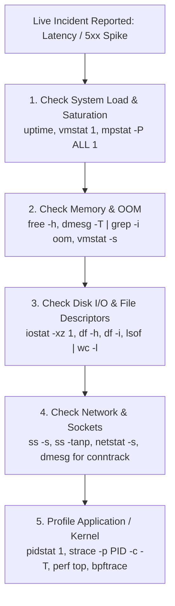

# 🛠️ Live Systems Troubleshooting & Debugging Playbook

> **Senior/Staff Interview Scope**: Methodical systems triage under pressure (The USE Method, The RED Method), live diagnostic commands (`perf`, `strace`, `sysdig`, `ss`, `tcpdump`, `bpftrace`), and root-cause isolation.

---

## 1. The Methodical Troubleshooting Hierarchy (The USE Method)

When thrown into a live debugging interview scenario, **never guess blindly**. Follow Brendan Gregg's **USE Method** for every resource (CPU, Memory, Disk, Network):
1. **U - Utilization**: How busy is the resource over time? (e.g. % CPU, % Disk IOPS)
2. **S - Saturation**: Is there work queued waiting for the resource? (e.g. CPU run queue, disk backlog)
3. **E - Errors**: Are operations failing? (e.g. dropped packets, disk read errors, OOM kills)



---

## 2. Essential Diagnostic Command Toolkit

### A. CPU & Process Profiling
```bash
# High-level CPU breakdown per core (%usr, %sys, %iowait, %irq, %soft)
mpstat -P ALL 1

# Process-level CPU, memory, and context switches (voluntary vs involuntary)
pidstat -u -r -w 1

# Profile top CPU-consuming functions in user and kernel space
perf top -F 99 -p <PID>

# Trace system calls for a slow process with timing and summary
strace -p <PID> -c -T -f
```

### B. Memory & Page Cache
```bash
# Summary of RAM, Available memory (free + reclaimable buffers), and Swap
free -h

# Inspect dirty pages awaiting flush to disk
cat /proc/meminfo | grep -iE 'dirty|writeback|anonpages|mapped|slab'

# Pressure Stall Information (PSI) - shows % time wasted waiting for memory
cat /proc/pressure/memory
```

### C. Storage & Disk I/O
```bash
# Extended I/O statistics (await = average wait time, %util = saturation)
iostat -xz 1

# Check inode exhaustion (common cause of 'No space left on device' when df -h shows free space)
df -i

# Identify processes holding open deleted files (unfreed disk space)
lsof +L1
```

### D. Networking & Sockets
```bash
# Socket summary statistics (TCP states: estab, closed, timewait)
ss -s

# Find listening ports and processes with queue lengths (Send-Q > 0 indicates backlog overflow!)
ss -lntp

# Real-time packet capture filtering for TCP resets or drops
tcpdump -nn -i any 'tcp[tcpflags] & (tcp-rst|tcp-fin) != 0' -c 50

# Track dropped packets at interface level
ip -s link show eth0
```

---

## 3. Real-Time Systems Triage Cheat Sheet

| Symptom | Diagnostic Tool | Likely Root Cause | Remediation |
|---|---|---|---|
| **High Load Avg + Low CPU %** | `vmstat 1` (`b` column > 0), `iostat -xz 1` (`%util` ~ 100%) | Heavy unbuffered disk writes or slow network mount (NFS/EFS) | Tune `vm.dirty_ratio`, switch to local NVMe, optimize I/O patterns |
| **P99 Latency Spikes in Container** | `cat /sys/fs/cgroup/cpu/cpu.stat` | CFS Quota bandwidth throttling | Increase CPU quota, adjust `cpu.cfs_period_us`, or remove limits |
| **`EADDRNOTAVAIL` on Outbound HTTP** | `ss -tan \| grep TIME_WAIT \| wc -l` | Ephemeral port exhaustion from lack of connection pooling | Enable HTTP Keep-Alive, enable `net.ipv4.tcp_tw_reuse = 1` |
| **Packets randomly dropping under load** | `dmesg \| grep -i conntrack` or `netstat -s` | Conntrack table saturation or listen backlog overflow | Increase `nf_conntrack_max` / `somaxconn` or migrate to Cilium eBPF |
| **Process unkillable (`kill -9` fails)** | `ps aux \| grep ' D '` | Process stuck in Uninterruptible Sleep (D state) waiting on disk/NFS lock | Fix underlying storage/NFS server; only reboot frees kernel D state |
