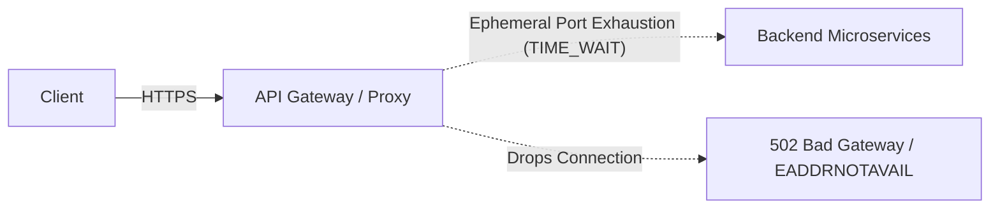

# 💥 Scenario 2: Mysterious 502 Bad Gateway & Port Exhaustion

> **Interview Prompt**:  
> *"An API Gateway proxying traffic to backend microservices suddenly starts returning 502 Bad Gateway errors for ~15% of user requests during a peak traffic surge. CPU and RAM on both the gateway and backend pods are well below 40%. How do you debug this?"*

---

## 1. Initial Assessment & Mental Model



- **502 Bad Gateway**: Means the API Gateway received an invalid response or **failed to establish a TCP connection** to upstream backends.
- **Key Suspects**:
  1. Ephemeral port exhaustion on the API gateway due to lack of HTTP Keep-Alive connection pooling.
  2. Linux `somaxconn` or `listen` backlog overflow on backend pods.
  3. `nf_conntrack` table saturation on worker nodes.
  4. Node-level SNAT port exhaustion (AWS NAT Gateway or GCP Cloud NAT).

---

## 2. Step-by-Step Diagnostic Walkthrough

### Step 1: Inspect API Gateway Error Logs
```bash
# Check gateway upstream connection errors
tail -f /var/log/nginx/error.log | grep -E 'connect() failed|no live upstreams'
```
- Common log clues:
  - `connect() failed (99: Cannot assign requested address) while connecting to upstream` -> **Ephemeral Port Exhaustion!**
  - `connect() failed (111: Connection refused)` -> **Upstream process crashed or listen queue full!**
  - `connect() failed (110: Connection timed out)` -> **Firewall/Security Group drop or conntrack table full!**

### Step 2: Check Sockets in `TIME_WAIT` on API Gateway
```bash
ss -s
ss -tan | awk '{print $1}' | sort | uniq -c
```
- If you see `timewait: 28,000+` and `net.ipv4.ip_local_port_range` is `32768 60999`, the proxy has completely run out of source ports to open new outgoing TCP sockets.

### Step 3: Check Backend Socket Listen Queue Overflows
On the backend servers:
```bash
# Look at the Send-Q column on the listening port (e.g. 8080)
ss -lnt '( sport = :8080 )'

# Check TCP drop counter due to listen queue overflow
netstat -s | grep -i "listen"
# Or:
cat /proc/net/netstat | awk '/TcpExt/ {print}'
```
- If `Send-Q` exceeds `somaxconn` (default 128 on older Linux kernels) or `listen_overflows` is incrementing, backend application threads cannot keep up with `accept()`ing incoming connections.

---

## 3. Remediation & Production Fixes

1. **Fix Upstream HTTP Connection Pooling (Core Fix)**:
   - Configure HTTP Keep-Alive on the API Gateway:
     ```nginx
     upstream backend_cluster {
         server 10.0.1.50:8080;
         server 10.0.1.51:8080;
         keepalive 256; # Keep idle connections open to avoid re-handshaking
     }
     ```
2. **Enable Kernel `tcp_tw_reuse`**:
   ```bash
   sysctl -w net.ipv4.tcp_tw_reuse=1
   sysctl -w net.ipv4.ip_local_port_range="1024 65535"
   ```
3. **Increase Backend Accept Backlog**:
   ```bash
   sysctl -w net.core.somaxconn=4096
   sysctl -w net.ipv4.tcp_max_syn_backlog=8192
   ```
4. **If NAT Gateway SNAT Port Exhaustion (AWS/GCP)**:
   - Check CloudWatch metric `ErrorPortAllocation` on AWS NAT Gateway.
   - Allocate secondary Elastic IPs to the NAT Gateway or use VPC Endpoints / PrivateLink for internal traffic to avoid traversing the NAT Gateway.
