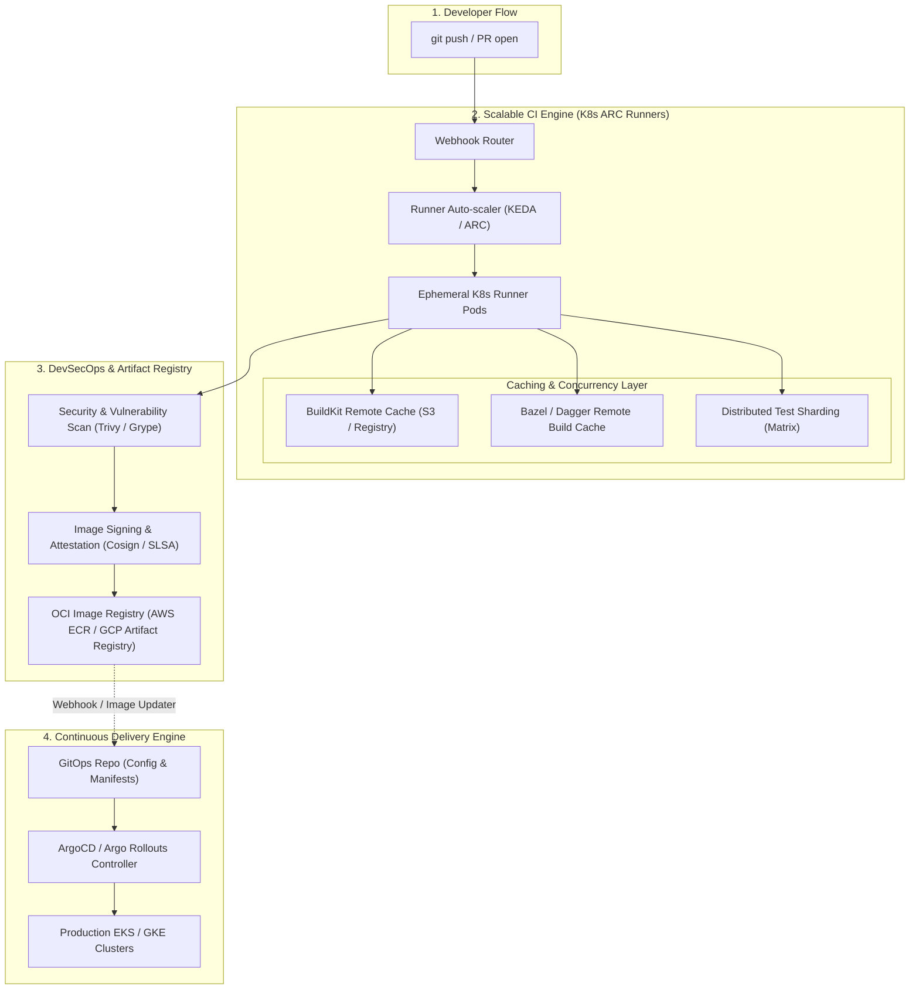

# 🚀 Enterprise CI/CD Pipeline Architecture at Scale

> **Senior/Staff Interview Scope**: Monorepo vs Polyrepo CI/CD architectures, distributed build caching (Dagger, Bazel, BuildKit), self-hosted runner fleets on Kubernetes (Actions Runner Controller - ARC), pipeline-as-code governance, and matrix build optimization.

---

## 1. High-Scale CI/CD Pipeline Architecture



---

## 2. Monorepo vs Multi-Repo CI/CD Strategies

| Dimension | Monorepo (Bazel / Nx / Turborepo) | Multi-Repo (GitHub Actions / GitLab CI) |
|---|---|---|
| **Blast Radius** | High if pipeline is naive; requires strict path-based change detection | Isolated per microservice repository |
| **Build Optimization** | Incremental computation graphs; tests only run if code or dependencies changed | Requires explicit layer caching and artifact sharing |
| **Dependency Management** | Single source of truth, atomic multi-package refactoring | Requires semantic version bumps and contract testing |
| **Runner Scaling** | Heavy burst capacity needed; requires Kubernetes-based ephemeral runner pools | Distributed load across standard runner pools |

---

## 3. Remote Build Caching & Docker BuildKit Optimization

1. **Multi-Stage Builds**:
   - Separate build tools (compilers, SDKs) from the final minimal runtime image (Distroless or Alpine).
2. **BuildKit Cache Invalidation Rules**:
   - Order Dockerfile commands from least frequently changed (OS packages) to most frequently changed (application source code).
   - Use cache mounts to avoid re-downloading dependencies:
     ```dockerfile
     # Go dependency cache mount
     RUN --mount=type=cache,target=/go/pkg/mod \
         --mount=type=cache,target=/root/.cache/go-build \
         go build -v -o /bin/app ./cmd/server
     ```
3. **Registry-Backed Cache (`--cache-to=type=registry`)**:
   - Export intermediate build cache directly to AWS ECR / GCP Artifact Registry to share build cache across all CI runner nodes.

---

## 4. Autoscaling CI Runners on Kubernetes (ARC)

- **GitHub Actions Runner Controller (ARC)**:
  - Deploys runner pods directly inside AWS EKS or GCP GKE.
  - Autoscales runners using webhook-driven metrics: scales from 0 to 500 pods in seconds when large PR batch jobs trigger.
  - Automatically provisions runner nodes via **Karpenter** on AWS Spot instances to reduce CI compute costs by 70%.

---

## 🎯 Top Senior Interview Questions & Model Answers

### Q1: "How do you reduce a 45-minute CI build and test pipeline down to under 5 minutes for a large engineering team?"
> **Answer**:
> 1. **Test Sharding & Parallelization**: Split the test suite across 10-20 parallel runner containers using test sharding tools (e.g. `knapsack-pro` or custom hash-based splitting).
> 2. **Remote Build Caching**: Implement BuildKit inline/registry caching for container builds and Dagger/Bazel for language dependencies so unchanged modules return instant cache hits.
> 3. **Ephemeral K8s Runner Pool**: Use Actions Runner Controller (ARC) with warm pre-pulled base images and NVMe local storage on Spot instances.
> 4. **Path-Based Change Detection**: Run only relevant linting, unit tests, and integration tests for modified directories instead of running the entire pipeline on every commit.
