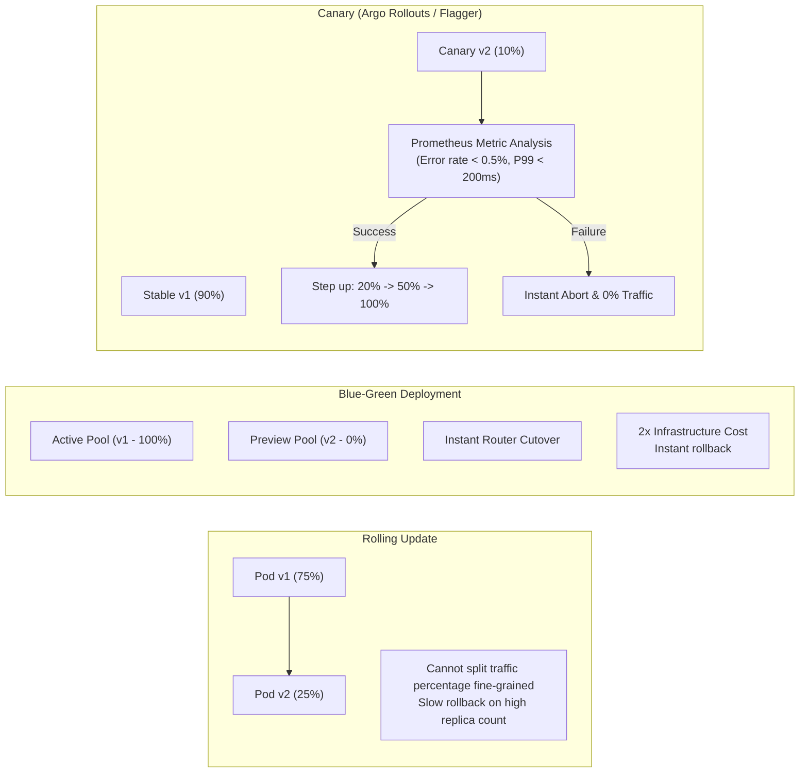

# 🚦 Progressive Delivery: Canary, Blue-Green & Automated Rollback

> **Senior/Staff Interview Scope**: Deployment strategies (Rolling, Blue-Green, Canary, Dark Launches, Shadow Traffic), Argo Rollouts vs Flagger, metric analysis engines (Prometheus / Datadog queries for automated rollbacks), and service mesh traffic shaping (Istio / Envoy).

---

## 1. Deployment Strategies Compared



| Strategy | Traffic Splitting | Resource Overhead | Rollback Time | Risk Level |
|---|---|---|---|---|
| **Rolling Update** | Coarse-grained (pod count ratio) | $1.25\times$ (maxSurge) | Moderate (minutes) | Medium |
| **Blue-Green** | All-or-Nothing switch | $2.0\times$ (full duplicate pool) | Instant (seconds) | Low |
| **Canary** | Precise fine-grained (1%, 5%, 20%) | $1.1\times$ to $1.2\times$ | Instant automated rollback | Lowest |
| **Shadow / Dark** | Duplicated live traffic (response discarded) | $2.0\times$ | Zero user impact | Zero |

---

## 2. Argo Rollouts Architecture & AnalysisTemplate

### Anatomy of an Automated Canary Rollout Manifest
```yaml
apiVersion: argoproj.io/v1alpha1
kind: Rollout
metadata:
  name: payment-service
spec:
  replicas: 20
  strategy:
    canary:
      analysis:
        templates:
          - templateName: success-rate-and-latency
        args:
          - name: service-name
            value: payment-service
      steps:
        - setWeight: 5
        - pause: { duration: 10m } # Real-time Prometheus analysis runs during pause
        - setWeight: 20
        - pause: { duration: 15m }
        - setWeight: 50
        - pause: { duration: 10m }
```

### AnalysisTemplate for Metric Verification
```yaml
apiVersion: argoproj.io/v1alpha1
kind: AnalysisTemplate
metadata:
  name: success-rate-and-latency
spec:
  metrics:
    - name: error-rate-check
      interval: 30s
      successCondition: result[0] <= 0.005 # Less than 0.5% errors
      failureLimit: 2 # Abort rollout if 2 consecutive checks fail
      provider:
        prometheus:
          address: http://thanos-querier.monitoring.svc:9090
          query: |
            sum(rate(http_requests_total{service="payment-service", status=~"5.*"}[2m]))
            /
            sum(rate(http_requests_total{service="payment-service"}[2m]))
```

---

## 3. Istio / Envoy Traffic Routing & Header-Based Canary

Rather than simple percentage weighting, progressive delivery at MAANG often uses **Header / User-ID based routing**:
```yaml
apiVersion: networking.istio.io/v1alpha3
kind: VirtualService
metadata:
  name: payment-service-vs
spec:
  hosts:
    - payment.internal.net
  http:
    - match:
        - headers:
            x-user-tier:
              exact: internal-beta-tester
      route:
        - destination:
            host: payment-service-canary
    - route:
        - destination:
            host: payment-service-stable
```

---

## 🎯 Top Senior Interview Questions & Model Answers

### Q1: "How do you prevent a bad database migration from breaking a Canary deployment where v1 and v2 run simultaneously?"
> **Answer**:
> - Never perform destructive or non-backwards-compatible schema changes in a single release.
> - Follow the **Expand / Contract (Parallel Change) Pattern**:
>   1. **Phase 1 (Expand)**: Add the new column or table. Old code (v1) ignores it; new code (v2) writes to both old and new.
>   2. **Phase 2 (Backfill)**: Run asynchronous background migration jobs to backfill historical data.
>   3. **Phase 3 (Switch)**: Canary rollout v2 which reads exclusively from the new column.
>   4. **Phase 4 (Contract)**: After v2 is 100% stable and v1 is retired, drop the old column/table in a separate PR.
