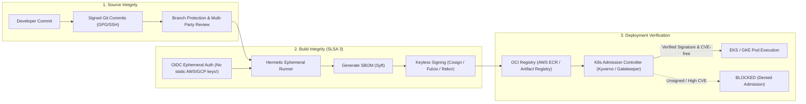

# 🛡️ Software Supply Chain Security & DevSecOps

> **Senior/Staff Interview Scope**: SLSA framework (Supply-chain Levels for Software Artifacts), Sigstore/Cosign container signing, Software Bill of Materials (SBOM with Syft/Grype), admission control enforcement (Kyverno / OPA Gatekeeper), and zero-trust CI/CD credentials (OIDC without long-lived keys).

---

## 1. The Modern Software Supply Chain Threat Model



---

## 2. Eliminating Static Cloud Credentials in CI/CD (OIDC Federation)

Never store long-lived `AWS_SECRET_ACCESS_KEY` or GCP service account keys in GitHub/GitLab repository secrets.

### AWS IAM GitHub Actions OIDC Trust Policy
```json
{
  "Version": "2012-10-17",
  "Statement": [
    {
      "Effect": "Allow",
      "Principal": {
        "Federated": "arn:aws:iam::123456789012:oidc-provider/token.actions.githubusercontent.com"
      },
      "Action": "sts:AssumeRoleWithWebIdentity",
      "Condition": {
        "StringEquals": {
          "token.actions.githubusercontent.com:aud": "sts.amazonaws.com"
        },
        "StringLike": {
          "token.actions.githubusercontent.com:sub": "repo:my-org/payment-service:ref:refs/heads/main"
        }
      }
    }
  ]
}
```

---

## 3. Container Signing with Sigstore / Cosign & Keyless Verification

### 1. Generating Image Attestation & Signing in CI
```bash
# Generate SBOM (Software Bill of Materials)
syft packages 123456789012.dkr.ecr.us-east-1.amazonaws.com/payment:v1.2.0 -o spdx-json > sbom.json

# Attach SBOM to image registry
cosign attach sbom --sbom sbom.json 123456789012.dkr.ecr.us-east-1.amazonaws.com/payment:v1.2.0

# Keyless signing via GitHub Actions OIDC token
cosign sign --yes 123456789012.dkr.ecr.us-east-1.amazonaws.com/payment:v1.2.0
```

### 2. Kubernetes Policy Enforcement (Kyverno ClusterPolicy)
```yaml
apiVersion: kyverno.io/v1
kind: ClusterPolicy
metadata:
  name: check-image-signature
spec:
  validationFailureAction: Enforce
  rules:
    - name: verify-signature-rule
      match:
        any:
          - resources:
              kinds:
                - Pod
      verifyImages:
        - imageReferences:
            - "123456789012.dkr.ecr.us-east-1.amazonaws.com/*"
          attestors:
            - entries:
                - keyless:
                    issuer: "https://token.actions.githubusercontent.com"
                    subject: "https://github.com/my-org/payment-service/.github/workflows/deploy.yml@refs/heads/main"
```

---

## 🎯 Top Senior Interview Questions & Model Answers

### Q1: "What is an SBOM and why is it critical during zero-day vulnerabilities like Log4j?"
> **Answer**:
> - An **SBOM (Software Bill of Materials)** is a machine-readable nested inventory of all direct and transitive third-party dependencies, libraries, licenses, and compiler versions contained within an application or container artifact (SPDX or CycloneDX format).
> - During a critical zero-day (e.g. Log4Shell), instead of executing manual static scans across thousands of git repositories or waiting for builds, security teams can instantly query a centralized SBOM database (like Dependency-Track or AWS Inspector) to query across every container deployed in production within seconds.
