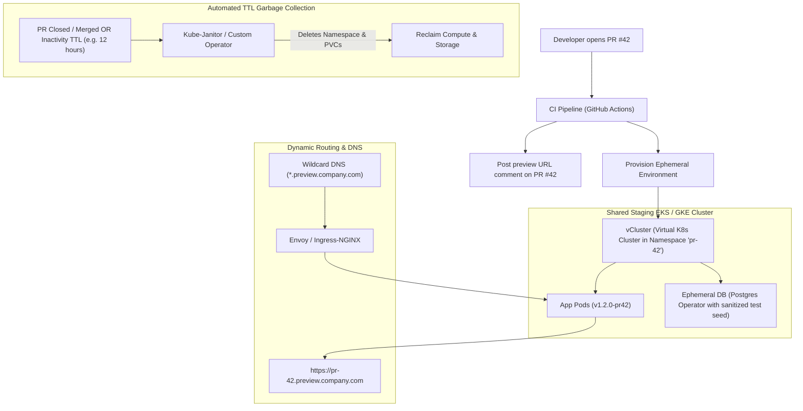

# 🏗️ Ephemeral Environments & PR Preview Platforms

> **Senior/Staff Interview Scope**: Dynamic on-demand environments for Pull Requests, lightweight multi-tenancy (vCluster vs isolated namespaces), database seeding & data masking, automated TTL cleanup, and DNS wildcard routing.

---

## 1. Ephemeral PR Preview Architecture



---

## 2. vCluster vs Namespace-Based Isolation

| Feature | Namespace-Only Isolation | vCluster (Virtual Kubernetes) |
|---|---|---|
| **Control Plane** | Shared host cluster API Server | Isolated virtual API Server & etcd per PR |
| **CRD & Operator Testing** | Restricted (cannot install custom CRDs without cluster-admin permissions) | Full cluster-admin access inside virtual cluster; safe CRD testing |
| **Blast Radius** | Medium (RBAC or resource quota misconfiguration can impact other namespaces) | Ultra-low (syncer only syncs low-level pods to host namespace) |
| **Startup Latency** | ~5–10 seconds | ~15–30 seconds |
| **Cost** | Minimal (Pod overhead only) | Minimal (~1 lightweight API server pod per environment) |

---

## 3. Database Strategy: Mocking vs Anonymized Seeding

1. **Option A: Ephemeral In-Cluster DB Container**:
   - Best for fast integration tests. Spin up a Postgres/MySQL container pre-loaded with a sanitized 10MB seed dataset.
2. **Option B: Branchable Cloud Databases (e.g. Neon, PlanetScale, Aurora Clone)**:
   - Creates a copy-on-write database branch in under 5 seconds pointing to an anonymized staging dataset.
3. **Option C: Shared DB with Tenant/Schema Sharding**:
   - Route requests with header `x-pr-id: 42` to a dedicated PostgreSQL schema (`schema_pr42`) dropped upon PR closure.

---

## 4. Automated Garbage Collection (Preventing Cost Leaks)

Use **Kube-Janitor** annotations on ephemeral namespaces to guarantee deletion:
```yaml
apiVersion: v1
kind: Namespace
metadata:
  name: pr-42-preview
  annotations:
    janitor/ttl: "12h" # Automatically deleted after 12 hours
    janitor/expires: "2026-09-04T18:00:00Z"
```
