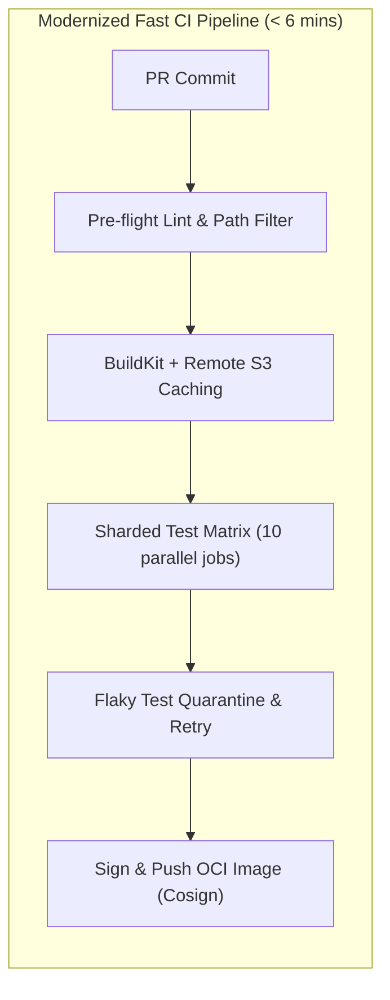

# 💥 Scenario: Flaky CI Pipelines & A Broken Canary Rollout

> **Interview Prompt**:  
> *"Your company's primary checkout microservice deploys 20 times a day. Recently, CI build times spiked from 8 minutes to 45 minutes with a 30% flaky test failure rate. Yesterday, a deployment reached 50% canary before causing a 500 Internal Server Error spike for international users, but the automated rollback failed to trigger and was caught manually 25 minutes later. How do you re-architect both the CI pipeline and the progressive canary system?"*

---

## 1. Problem Analysis & Root Cause Breakdown

1. **CI Bottlenecks & Flakiness**:
   - Lack of layer caching in container builds (re-downloading NPM/Go modules on every run).
   - Monolithic test suite running sequentially on a single runner VM.
   - Tests with external network dependencies or asynchronous timing race conditions.
2. **Canary Analysis Blindspot**:
   - The canary metric query was likely an aggregate global error rate (`sum(rate(5xx)) / sum(rate(all))`).
   - Because international traffic represented only 10% of total volume, a 100% failure rate for international users only moved the global error rate needle by 1%, which sat below the global 2% alert threshold.
   - The analysis template lacked dimension/tag slicing (`region` or `country_code`).

---

## 2. Re-Architecting the CI Pipeline



### Action Items:
1. **Implement BuildKit Remote Caching**:
   - Cache Go/Node modules via S3 bucket or OCI registry layer caching.
2. **Test Sharding & Flaky Test Quarantine**:
   - Split 5,000 unit/integration tests across 10 parallel Kubernetes ephemeral runner pods using hash-based test chunking.
   - Quarantine flaky tests into a separate non-blocking suite with automated GitHub issue filing.
3. **Dedicated Ephemeral Service Mocking**:
   - Use Testcontainers / WireMock instead of hitting live external third-party sandbox APIs.

---

## 3. Re-Architecting Progressive Canary Delivery

### Multi-Dimensional Canary Analysis Metric
Instead of a single global average, slice metrics by geographical region or tenant tier:

```yaml
apiVersion: argoproj.io/v1alpha1
kind: AnalysisTemplate
metadata:
  name: sliced-error-rate-and-latency
spec:
  metrics:
    # Check 1: Sliced regional error rate
    - name: regional-5xx-rate
      interval: 30s
      successCondition: result[0] <= 0.01 # Max 1% error rate per region
      failureLimit: 2 # Immediate abort on 2 consecutive fails
      provider:
        prometheus:
          address: http://thanos-query.monitoring.svc:9090
          query: |
            max by (region) (
              sum by (region) (rate(http_requests_total{service="checkout", status=~"5.*"}[2m]))
              /
              sum by (region) (rate(http_requests_total{service="checkout"}[2m]) > 10)
            )

    # Check 2: P99 Latency degradation
    - name: p99-latency-check
      interval: 1m
      successCondition: result[0] <= 350 # 350ms max
      failureLimit: 2
      provider:
        prometheus:
          address: http://thanos-query.monitoring.svc:9090
          query: |
            histogram_quantile(0.99, sum(rate(http_request_duration_seconds_bucket{service="checkout"}[2m])) by (le))
```

---

## 4. Key Takeaways for the Interviewer
- Show that you think about **statistical granularity**: global averages hide regional or high-value tenant outages.
- Show that you build **defensive automation**: fast pipelines encourage small, frequent commits which naturally reduce the blast radius of failure.
