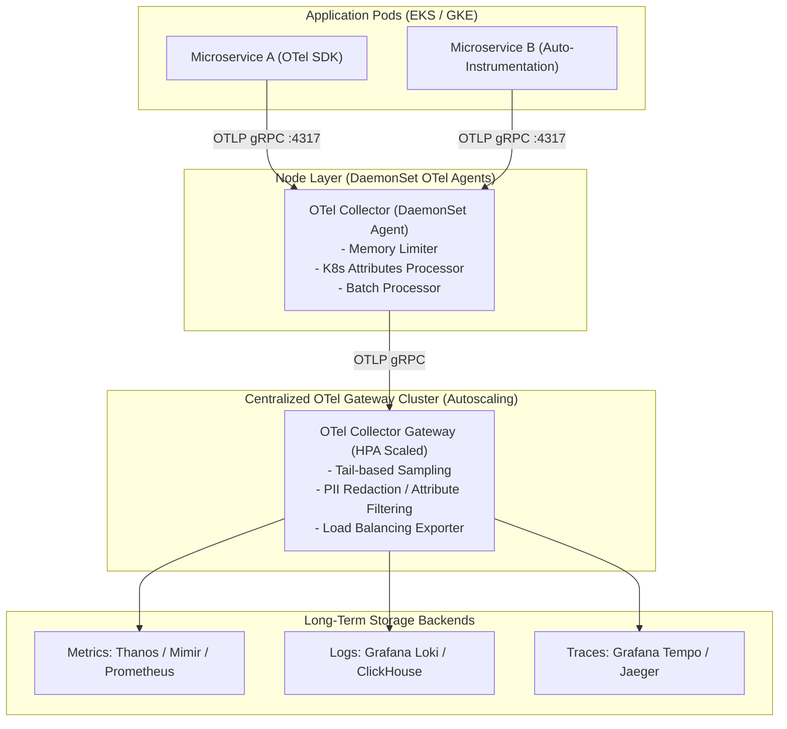

# 🔭 OpenTelemetry (OTel) Architecture & High-Throughput Pipelines

> **Senior/Staff Interview Scope**: OpenTelemetry specification (Traces, Metrics, Logs), OTel Collector deployment topologies (Agent vs Gateway), pipeline processing (batch, memory limiter, transform), tail-based sampling vs head-based sampling, and high-cardinality data redaction.

---

## 1. End-to-End OpenTelemetry Pipeline Architecture



---

## 2. OTel Collector Deployment Modes: DaemonSet vs Gateway

| Architectural Pattern | Pros | Cons | Best Use Case |
|---|---|---|---|
| **DaemonSet (Node Agent)** | Local localhost ingestion (`localhost:4317`), enriches k8s metadata locally, minimal pod network hops | Cannot perform cross-node tail-based trace sampling | First hop for all cluster workloads |
| **Cluster Gateway (Deployment)** | Centralized tail-based sampling, centralized secret management for egress backends, HPA autoscaling | Additional network hop | Aggregation layer between agents and storage |
| **Hybrid (Recommended)** | Best of both: Fast local ingestion + powerful centralized sampling & routing | Slightly higher complexity | Production Tier-1 / Enterprise architectures |

---

## 3. Tail-Based vs Head-Based Sampling

```mermaid
flowchart TD
    subgraph Head_Based["Head-Based Sampling (Decided at Root Span start)"]
        Start1["Request Arrives"] --> Decision1{"Sample 5%?"}
        Decision1 -->|Yes| Trace1["Full trace collected"]
        Decision1 -->|No| Drop1["Trace discarded (Even if it fails with 500 error later!)"]
    end

    subgraph Tail_Based["Tail-Based Sampling (Decided after entire trace finishes)"]
        Start2["Request Arrives"] --> Buffer["Buffer all spans in OTel Gateway memory"]
        Buffer --> Complete["Trace finishes in 2.5s with HTTP 500"]
        Complete --> RuleCheck{"Matches Rules?<br/>- HTTP 5xx Status<br/>- Latency > 1.0s<br/>- High-value Tenant"}
        RuleCheck -->|Yes| Save2["Keep 100% of error/slow traces"]
        RuleCheck -->|No (Healthy fast trace)| Downsample["Sample only 1% of normal 200 OKs"]
    end
```

### Production Tail-Sampling Configuration in OTel Collector
```yaml
processors:
  tail_sampling:
    decision_wait: 10s
    num_traces: 50000
    expected_new_traces_per_sec: 5000
    policies:
      # Always sample errors
      - name: sample-errors
        type: status_code
        status_code: { status_codes: [ERROR] }

      # Always sample slow queries (> 1.5s)
      - name: sample-high-latency
        type: numeric_attribute
        numeric_attribute:
          key: http.status_code
          value_condition: { min_value: 500 }

      # Downsample normal 200 OK traces to 1% to save storage costs
      - name: probabilistic-healthy
        type: probabilistic
        probabilistic: { sampling_percentage: 1.0 }
```

---

## 4. Key Pipeline Processors in OTel
1. **`memory_limiter`**: MUST be the first processor in the pipeline to drop or backpressure incoming data before OOM crashes.
2. **`k8sattributes`**: Queries the local Kubelet API to inject `k8s.pod.name`, `k8s.namespace.name`, `k8s.node.name`.
3. **`transform` (OTTLE - OpenTelemetry Transformation Language)**: Used for redacting sensitive PII (credit cards, auth tokens) in-flight.
4. **`batch`**: Flushes spans/metrics in batches (e.g. 8192 items or 200ms) to maximize gRPC network throughput.
