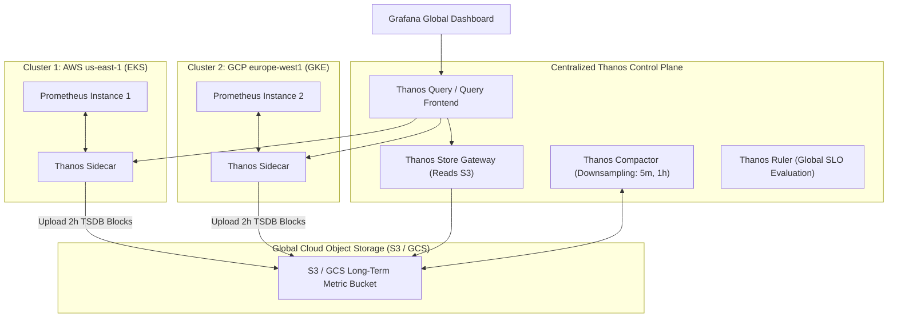

# 📊 Metrics at Scale: Prometheus, Thanos, Mimir & VictoriaMetrics

> **Senior/Staff Interview Scope**: Prometheus TSDB block format, Head chunk compaction, high-cardinality explosions, multi-cluster federation vs global querying, Thanos architecture (Sidecar, Store, Compact, Query, Ruler), and Grafana Mimir / VictoriaMetrics comparisons.

---

## 1. Thanos Global Multi-Cluster Architecture

---

## 2. Thanos Component Roles Explained

1. **Thanos Sidecar**: Runs alongside Prometheus. Ships 2-hour TSDB blocks to S3/GCS and answers real-time queries for recent data (< 2 hours).
2. **Thanos Store Gateway**: Implements the StoreAPI on top of historical TSDB blocks stored in S3/GCS. Uses index caching and chunk caching in Memcached/Redis for fast queries.
3. **Thanos Compactor**: Single-instance background worker. Merges historical 2-hour blocks into larger blocks and performs **downsampling** (5m and 1h resolutions for fast multi-year queries).
4. **Thanos Query / Frontend**: Evaluates PromQL queries across all Sidecars (real-time) and Store Gateways (historical), performing deduplication across HA Prometheus pairs.

---

## 3. Prometheus TSDB Deep Dive & High Cardinality

- **TSDB Structure**:
  - In-memory Head block: incoming samples written to Write-Ahead Log (WAL) on disk.
  - Every 2 hours, Head memory is cut into immutable TSDB blocks containing `chunks/`, `index`, `meta.json`, and `tombstones`.
- **The High Cardinality Danger**:
  - **Cardinality** = Total number of unique time-series:
    $$\text{Series Count} = \prod (\text{Unique values per label})$$
  - Anti-pattern: Storing `user_id`, `order_id`, or `ip_address` as Prometheus labels.
  - Result: Inverted index explodes in RAM, leading to uncontrollable OOM crashes (`oom-killed`).

---

## 4. Thanos vs Grafana Mimir vs VictoriaMetrics

| Feature | Thanos | Grafana Mimir | VictoriaMetrics |
|---|---|---|---|
| **Ingestion Model** | Pull (via Prometheus + Sidecar) or Push (Thanos Receive) | Push (via Prometheus Remote-Write) | Push & Pull (vmagent / vmstorage) |
| **Multi-Tenancy** | Soft multi-tenancy (via labels) | Native hard multi-tenancy (tenant-id header) | Native multi-tenancy (separate namespaces) |
| **Resource Efficiency** | Moderate (relies on Prometheus compute) | Higher memory footprint for microservices | Extremely high compression & low RAM |
| **Query Engine** | Thanos Query (PromQL) | Mimir Query-Frontend (PromQL split & cache) | MetricsQL (Extended PromQL with sub-queries) |
