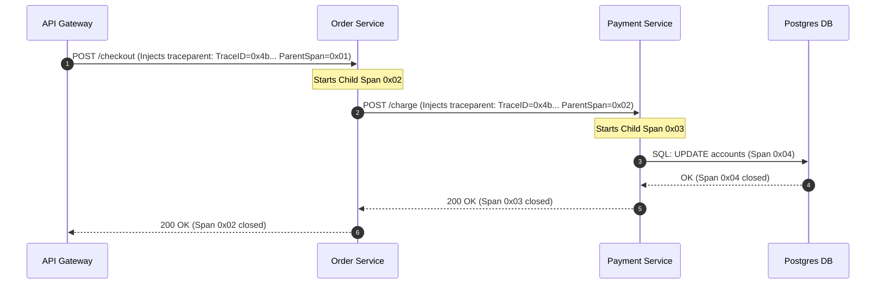

# 🔍 Distributed Tracing & Centralized Logging at Scale

> **Senior/Staff Interview Scope**: W3C Trace Context propagation (`traceparent`, `tracestate`), Grafana Tempo vs Jaeger, Grafana Loki vs Elasticsearch / OpenSearch indexing models, Vector / FluentBit high-throughput log collectors, and log cost reduction.

---

## 1. W3C Trace Context Propagation

For distributed tracing across microservices, trace context must pass through HTTP headers or gRPC metadata:

```
traceparent: 00-4bf92f3577b34da6a3ce929d0e0e4736-00f067aa0ba902b7-01
              │  └──────────────┬─────────────────┘ └───────┬──────┘ └─┬┘
           Version          Trace ID                    Parent Span ID  Flags (01=sampled)
```



---

## 2. Grafana Tempo vs Jaeger

- **Jaeger Architecture**:
  - Requires dedicated search indexing (typically on top of Elasticsearch or OpenSearch).
  - High operational cost: Storing inverted indices for every trace attribute makes indexing expensive at petabyte scale.
- **Grafana Tempo (Object-Storage Native Tracing)**:
  - **Index-free Architecture**: Tempo only indexes the `TraceID` and streams raw trace blocks directly to S3/GCS.
  - Cost is $10\times$ lower than Elasticsearch.
  - Search queries leverage **TraceQL** and integration with Prometheus metrics and Loki logs (jumping from a 500 error log line directly to the corresponding `TraceID`).

---

## 3. Centralized Logging: Loki vs Elasticsearch / OpenSearch

| Feature | Elasticsearch / OpenSearch | Grafana Loki |
|---|---|---|
| **Indexing Strategy** | Full-text indexing of the entire JSON message body | Indexes ONLY metadata labels (e.g. `app="payment"`, `namespace="prod"`) |
| **Storage Engine** | Lucene indices on EBS / SSD | Compressed log chunks on S3 / GCS |
| **Ingestion Throughput** | Lower (CPU-bound on inverted index generation) | Extremely high (lines are appended and compressed directly) |
| **Search Speed** | Instant arbitrary substring search across years of data | Fast for labeled queries; brute-force grep across chunks for unindexed text |
| **Cost** | High (Heavy RAM & NVMe SSD requirements) | Low (Runs on cheap S3 / GCS object storage) |

---

## 4. Vector: High-Performance Log Shipping Pipeline

Use **Vector** (written in Rust) as a DaemonSet to transform and drop debug logs before shipping:
```toml
[sources.kubernetes_logs]
type = "kubernetes_logs"

[transforms.filter_noisy_healthchecks]
type = "filter"
inputs = ["kubernetes_logs"]
# Drop 200 OK health checks to save 40% of log ingestion costs
condition = '!includes(["/healthz", "/readyz", "/metrics"], .message)'

[sinks.loki]
type = "loki"
inputs = ["filter_noisy_healthchecks"]
endpoint = "http://loki-gateway.monitoring.svc:3100"
encoding.codec = "json"
```
