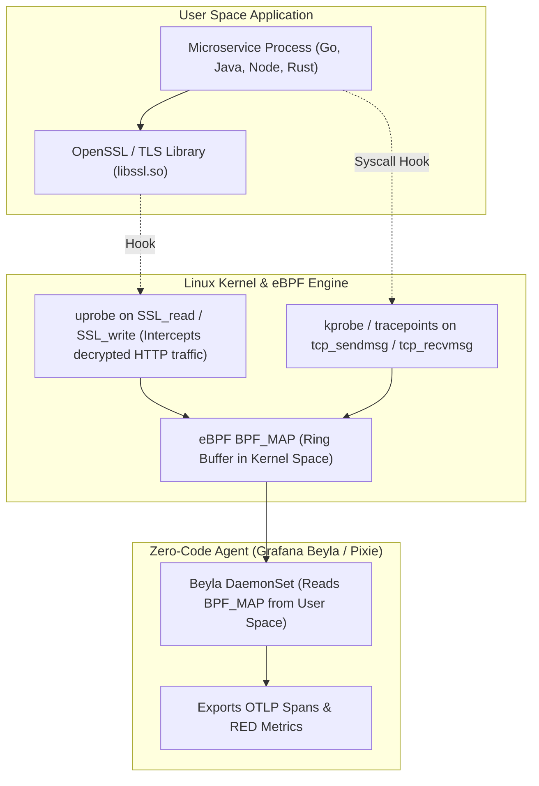

# 🐝 eBPF-Based Zero-Code Observability (Beyla, Pixie, Hubble)

> **Senior/Staff Interview Scope**: How eBPF provides instant kernel-level application observability without SDK instrumentation, uprobes vs kprobes, Grafana Beyla for auto-APM (RED metrics & OpenTelemetry traces), Cilium Hubble for L3-L7 network flow visibility, and continuous profiling (Parca / Pyroscope).

---

## 1. How eBPF Observability Works Under the Hood

---

## 2. Key Tools in the eBPF Observability Ecosystem

### 1. Grafana Beyla (Zero-Code Application Telemetry)
- Hooks into kernel syscalls and user-space libraries (`libc`, `libssl`, Go runtime).
- Automatically measures **RED Metrics (Rate, Errors, Duration)** for every HTTP/gRPC service without code changes or SDK recompilation.
- Generates W3C-compliant distributed trace spans automatically.

### 2. Cilium Hubble (Network & Security Observability)
- Runs inside the Cilium eBPF CNI.
- Captures L3/L4 packet flows and L7 HTTP/gRPC/Kafka protocol metadata.
- Produces live service dependency maps and flags dropped packets, DNS resolution failures, and network policy violations in real time.

### 3. Continuous Profiling (Pyroscope & Parca)
- Samples CPU stack traces 100 times/second per core using eBPF `perf_events`.
- Visualizes CPU flame graphs across production fleets to identify hidden algorithmic waste and memory allocations.

---

## 3. Tradeoffs: eBPF Auto-Instrumentation vs Manual OTel SDK

| Dimension | eBPF Auto-Instrumentation (Beyla / Pixie) | Manual OpenTelemetry SDK |
|---|---|---|
| **Adoption Velocity** | Instant (zero code changes; works for all 500+ legacy microservices) | Slow (requires developers to import SDKs and modify code) |
| **Domain Context** | Limited to network protocol attributes (HTTP path, status, latency) | Rich custom business metadata (`customer_id`, `cart_size`, `checkout_flow`) |
| **Span Granularity** | Inter-process boundaries only (cannot trace internal function calls) | Deep intra-process custom spans and exceptions |
| **Kernel Dependency** | Requires Linux Kernel 5.4+ with `BTF` (BPF Type Format) enabled | Works on any OS / cloud runtime |
| **Ideal Pattern** | **Baseline coverage with eBPF + Manual SDK for critical business logic** | Full manual coverage |
