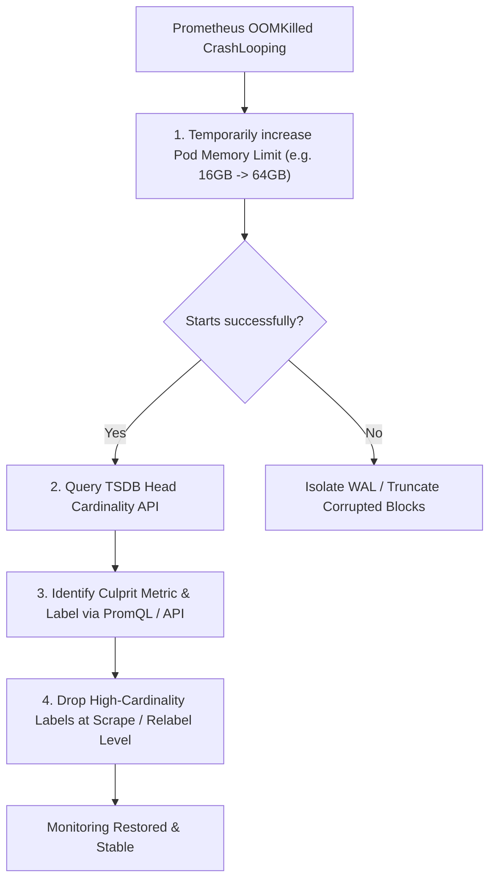

# 💥 Scenario: High-Cardinality Metric Explosion & Prometheus OOM CrashLoop

> **Interview Prompt**:  
> *"At 2:00 PM on Black Friday, your centralized Prometheus server in production starts CrashLooping with an OOMKilled (Exit 137) error every time it starts up. Grafana dashboards are completely blank, alerting is blind, and engineers cannot inspect production telemetry. How do you recover the monitoring infrastructure and prevent this permanently?"*

---

## 1. Problem Analysis & Root Cause Breakdown

- **Why Prometheus OOMs on Startup**:
  - When Prometheus restarts, it must replay the on-disk Write-Ahead Log (WAL) into the in-memory Head chunk.
  - If a deployment introduced a **high-cardinality label explosion** (e.g. `user_id`, `uuid`, or raw URL paths with dynamic path params like `/users/12938192/cart`), millions of new unique series were created in the Head chunk.
  - As Prometheus tries to rebuild its Head index during startup, RAM usage instantly spikes to 100% of the container memory limit, triggering the Linux OOM killer before it can complete WAL replay.

---

## 2. Emergency Recovery Steps (War Room Playbook)



### Step 1: Query the TSDB Head Cardinality API
```bash
# Query the top 10 highest cardinality labels in the Head block
curl -s http://prometheus:9090/api/v1/status/tsdb | jq '.data.seriesCountByMetricName[:5]'
curl -s http://prometheus:9090/api/v1/status/tsdb | jq '.data.labelValueCountByLabelName[:5]'
```
- Example output:
  ```json
  { "name": "user_id", "value": 4500000 }
  ```
  -> Metric `http_requests_total` has 4.5 million distinct values for `user_id`.

### Step 2: Emergency Metric Relabeling / Dropping
Immediately apply a `metric_relabel_configs` block to the Prometheus configuration to drop the offending label or the entire metric before it touches the TSDB:

```yaml
scrape_configs:
  - job_name: "kubernetes-pods"
    metric_relabel_configs:
      # Option 1: Drop the offending user_id label
      - regex: "user_id"
        action: labeldrop

      # Option 2: Drop the entire exploding metric
      - source_labels: [__name__]
        regex: "bad_custom_metric_total"
        action: drop
```

---

## 3. Long-Term Architectural Defenses

1. **Implement Scrape Series & Sample Limits**:
   ```yaml
   scrape_configs:
     - job_name: "app-services"
       sample_limit: 100000 # Hard cap: drops targets exceeding 100k samples
       series_limit: 50000  # Caps unique series per target
   ```
2. **Prometheus Rule CI Linter**:
   - Use `promtool check metrics` in the CI/CD pipeline to reject any PR adding unapproved unbounded labels (IDs, IP addresses, emails).
3. **Migrate to Thanos / Grafana Mimir Architecture**:
   - Shard Prometheus instances by namespace/service rather than running a single monolithic Prometheus.
   - Use OTel Collector with `attributes/filter` processors at the gateway edge to scrub dynamic path variables before exporting metrics.
