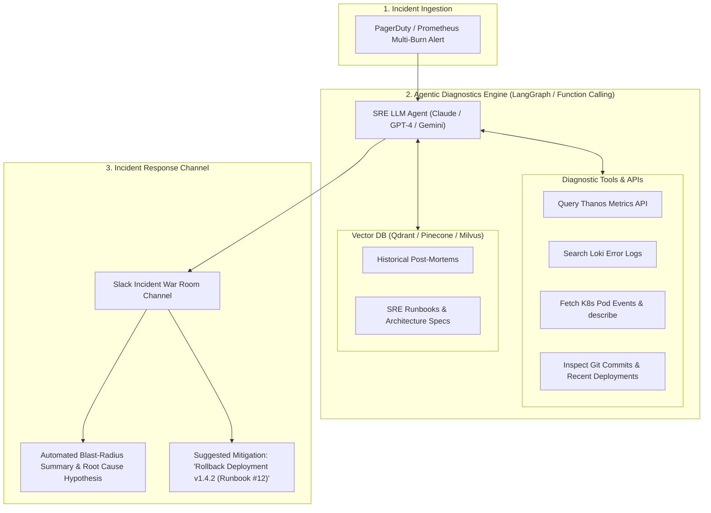

# 🤖 AIOps & LLM-Driven Incident Triage and Automated RCA

> **Senior/Staff Interview Scope**: Incorporating AI into modern SRE workflows, agentic incident triage pipelines, Retrieval-Augmented Generation (RAG) over past post-mortems and runbooks, log clustering with vector embeddings, and automated diagnostics with tool-calling agents.

---

## 1. The Autonomous SRE Incident Triage Architecture



---

## 2. RAG on Historical Post-Mortems: Vector Search

1. **Ingestion Pipeline**:
   - Every resolved incident post-mortem (markdown) is split into chunks (500 tokens).
   - Embedded using `text-embedding-3-large` or open-source embeddings (BGE-M3) and stored in a vector database.
2. **Real-Time Similarity Lookup**:
   - When an alert triggers with signature `connection reset by peer on database pool`, vector search retrieves the top 3 most similar historical incidents, who resolved them, and the exact corrective action taken.

---

## 3. Tool-Calling Agent Protocol for Automated Triage

The LLM agent is given structured functions/tools:
```python
tools = [
    {
        "name": "query_prometheus",
        "description": "Execute a PromQL query over the last 30 minutes",
        "parameters": {"type": "object", "properties": {"query": {"type": "string"}}},
    },
    {
        "name": "get_recent_deployments",
        "description": "Fetch deployments across the cluster within the last 1 hour",
        "parameters": {"type": "object", "properties": {"namespace": {"type": "string"}}},
    },
    {
        "name": "fetch_pod_logs",
        "description": "Stream the last 200 error log lines for a service",
        "parameters": {"type": "object", "properties": {"service_name": {"type": "string"}}},
    },
]
```

---

## 4. Guardrails & Safety in Autonomous Incident Remediation

> [!CAUTION]
> AI agents should **NEVER execute destructive mutating actions (e.g. deleting DBs or running untested shell scripts)** without human-in-the-loop approval.

- **Human-in-the-Loop Pattern**: The AI agent proposes a parameterized action in Slack with interactive buttons:
  - `[ Approve Rollback to v1.3.9 ]`
  - `[ Reject & Request Manual Triage ]`
- **Audit Logging**: Every tool invocation and model reasoning chain is recorded in the incident timeline for post-mortem compliance.
