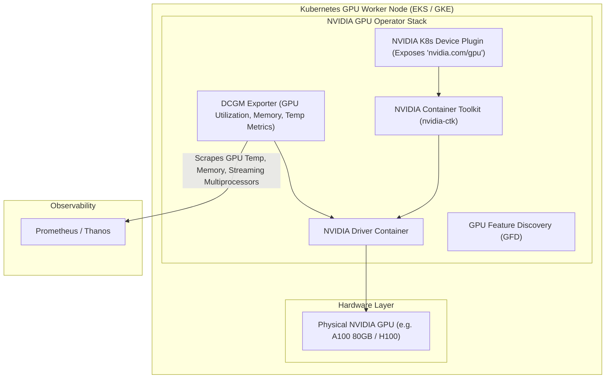

# ⚡ GPU Orchestration on Kubernetes (NVIDIA Operator, MIG & Time-Slicing)

> **Senior/Staff Interview Scope**: NVIDIA GPU Operator components (Driver, Container Toolkit, Device Plugin, DCGM Exporter), Multi-Instance GPU (MIG) vs GPU Time-Slicing, DRA (Dynamic Resource Allocation), and topology-aware scheduling for multi-GPU training.

---

## 1. The NVIDIA GPU Operator Architecture on Kubernetes



---

## 2. GPU Partitioning: MIG vs Time-Slicing

| Feature | NVIDIA MIG (Multi-Instance GPU) | GPU Time-Slicing |
|---|---|---|
| **Supported Hardware** | NVIDIA A100, H100, H200 only | Any NVIDIA GPU (T4, A10G, L4, V100, A100) |
| **Hardware Isolation** | **Hardware-level**: Dedicated SMs (Streaming Multiprocessors) and isolated HBM memory per slice | **Software-level**: Shared compute & memory; no memory protection between containers |
| **Failure Isolation** | A crash or CUDA OOM in one instance does NOT affect adjacent instances | A CUDA crash or OOM can crash all co-located pods |
| **QoS / SLA** | Predictable, guaranteed throughput | Non-deterministic (noisy neighbors) |
| **Best Use Case** | Multi-tenant production LLM inference fleets | Dev/Test environments, small embedding models |

### Example: Slicing an A100 80GB with MIG
- An A100 80GB can be partitioned into up to **7 isolated GPU instances**:
  - `nvidia.com/mig-1g.10gb: 7` (Seven 10GB GPU slices)
  - Or `nvidia.com/mig-3g.40gb: 2` (Two 40GB slices)

---

## 3. GPU Scheduling Spec in Pod Definitions

```yaml
apiVersion: v1
kind: Pod
metadata:
  name: vllm-llama3-inference
spec:
  containers:
    - name: vllm
      image: vllm/vllm-openai:latest
      resources:
        limits:
          nvidia.com/gpu: 2 # Requests 2 dedicated physical GPUs
        requests:
          nvidia.com/gpu: 2
      volumeMounts:
        - mountPath: /dev/shm
          name: dshm
  volumes:
    - name: dshm
      emptyDir:
        medium: Memory # Crucial for PyTorch IPC shared memory across multi-GPUs
```

---

## 4. DCGM Metrics for SRE Monitoring
1. `DCGM_FI_DEV_GPU_UTIL`: % GPU compute engine utilization.
2. `DCGM_FI_DEV_FB_USED` vs `DCGM_FI_DEV_FB_FREE`: GPU Framebuffer (VRAM) used vs free.
3. `DCGM_FI_DEV_GPU_TEMP`: GPU core temperature (throttling threshold detection).
4. `DCGM_FI_DEV_XID_ERRORS`: Hardware errors reported by the NVIDIA driver (XID 31 = memory page fault, XID 43 = GPU fall-off-bus).
