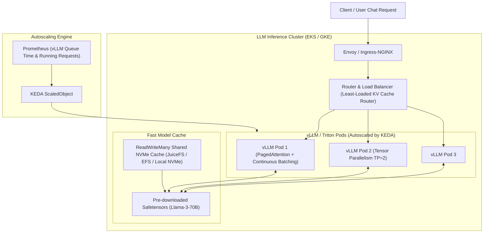

# 🤖 LLM Serving Infrastructure: vLLM, Triton & Ray on Kubernetes

> **Senior/Staff Interview Scope**: High-throughput LLM inference architectures, vLLM PagedAttention mechanics, Triton Inference Server dynamic batching, KubeRay cluster orchestration, and autoscaling with KEDA on token throughput & queue latency.

---

## 1. High-Scale LLM Serving Architecture



---

## 2. Why vLLM & PagedAttention Dominate Production Serving

1. **The KV Cache Memory Fragmentation Problem**:
   - In traditional autoregressive LLM serving (HuggingFace Transformers), KV cache memory must be allocated contiguously for maximum sequence length (e.g. 8k tokens), wasting 60–80% of GPU VRAM due to internal and external fragmentation.
2. **PagedAttention Solution**:
   - Inspired by OS virtual memory paging: Divides KV cache into fixed-size virtual blocks (e.g. 16 tokens/block).
   - Near-zero memory waste ($< 4\%$), allowing **$2\times$ to $4\times$ larger batch sizes** and $3\times$ higher token throughput.
3. **Continuous (Iteration-Level) Batching**:
   - Dynamically adds newly arrived requests to the running batch after every token generation iteration, eliminating idle GPU time while waiting for long generation requests to complete.

---

## 3. Triton Inference Server: Multi-Model & Dynamic Batching

- **Key Capabilities**:
  - Serves multiple framework models (TensorRT-LLM, ONNX, PyTorch, Python backend) on the same GPU.
  - **Dynamic Batching**: Queues individual client requests on the CPU side for a configurable time window (e.g. `max_queue_delay_microseconds: 5000`) to form large GPU batches.
  - **Ensemble Pipelines**: Chains preprocessing (tokenization in C++), GPU model inference, and postprocessing in a zero-copy shared-memory pipeline.

---

## 4. Autoscaling LLM Serving Fleets with KEDA

Standard CPU/Memory HPA fails for LLM serving because GPU memory is static (model weights remain loaded in VRAM). Autoscaling must be driven by **Inference Request Queue Latency** or **Active Request Count**:

```yaml
apiVersion: keda.sh/v1alpha1
kind: ScaledObject
metadata:
  name: vllm-llama3-autoscaler
spec:
  scaleTargetRef:
    name: vllm-llama3-deployment
  minReplicaCount: 2
  maxReplicaCount: 20
  cooldownPeriod: 300
  triggers:
    - type: prometheus
      metadata:
        serverAddress: http://thanos-query.monitoring.svc:9090
        metricName: vllm_num_requests_waiting
        threshold: "5" # Scale out if average waiting queue > 5 requests
        query: sum(vllm:num_requests_waiting{namespace="ai-prod"}) / sum(vllm:num_requests_running{namespace="ai-prod"})
```
