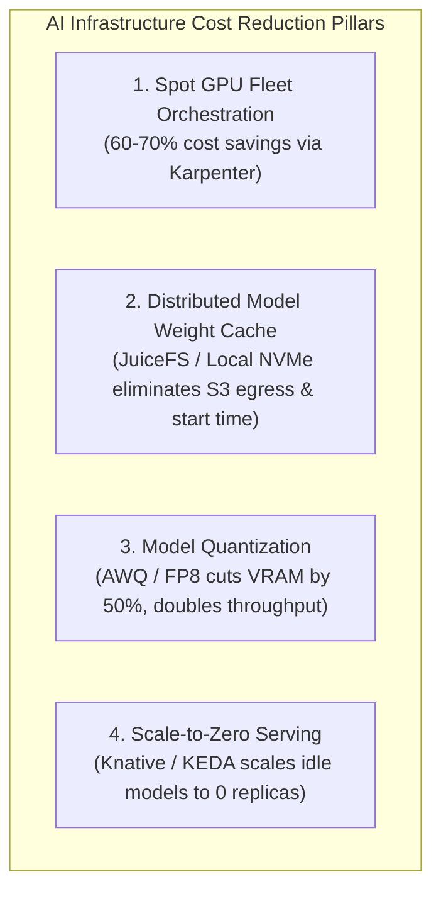
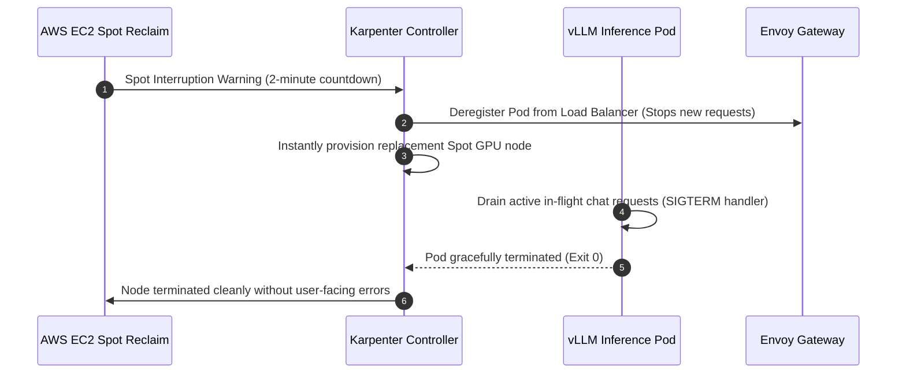

# 💰 AI Infrastructure Cost Optimization & FinOps (GPU Fleets)

> **Senior/Staff Interview Scope**: GPU cost reduction at scale, AWS Spot GPU vs On-Demand orchestration with Karpenter, model weight caching strategies (S3/GCS vs high-throughput NVMe), scale-to-zero serving, and quantization tradeoffs (FP16 vs INT8 vs AWQ/GPTQ).

---

## 1. The Economics of AI Infrastructure

An NVIDIA H100 or A100 8-GPU node costs ~$30–$40/hour on AWS/GCP (~$25,000–$30,000/month per instance).
Without aggressive platform automation, 40–60% of GPU compute is wasted on idle time, slow model downloads, and unoptimized batch sizes.

---

## 2. Spot GPU Orchestration with Karpenter on AWS

### Handling the 2-Minute Spot Interruption Notice
When AWS reclaims a Spot GPU instance, it sends a CloudWatch Event / EC2 metadata notice 120 seconds before termination.

---

## 3. High-Speed Model Weight Streaming (Cold-Start Reduction)

- **The Problem**: Downloading a 140GB model (Llama-3-70B) from Amazon S3 on pod startup takes 5–10 minutes, making rapid autoscaling impossible.
- **The Solution**:
  1. **Node-Local NVMe Pre-warming**: Use a DaemonSet to sync safetensors into `/mnt/nvme/models` on all GPU worker nodes.
  2. **JuiceFS / Fast Object-Storage Cache**: Mounts S3 as a POSIX filesystem with local memory and SSD caching, achieving up to **5 GB/s streaming throughput**.
  3. **Result**: Cold start reduced from 10 minutes down to **under 20 seconds**.

---

## 4. Model Quantization & Hardware Multipliers

| Precision Format | Bits per Weight | Memory for 70B Model | Per-Token Latency | Accuracy Retention |
|---|---|---|---|---|
| **FP16 / BF16** | 16 bits | ~140 GB (Requires 2x A100 80GB) | Baseline | 100% |
| **FP8 (H100 Native)** | 8 bits | ~70 GB (Fits on 1x H100 80GB) | $2\times$ faster | > 99.8% |
| **AWQ / GPTQ (INT4)** | 4 bits | ~35 GB (Fits on 1x A100 40GB) | $3\times$ faster | > 98.5% |

> **Key Interview Takeaway**: Quantizing from FP16 to FP8 or AWQ reduces hardware requirements from **2 GPUs down to 1 GPU**, instantly slashing infrastructure costs by **50%**.
