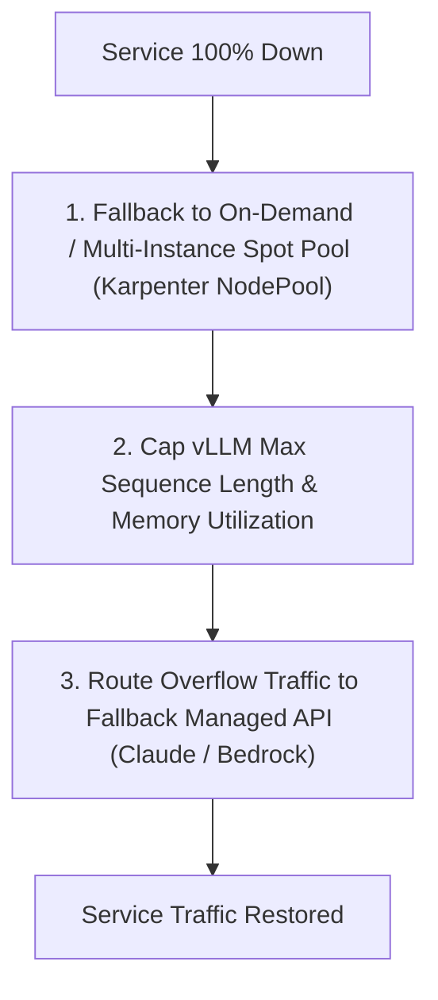

# 💥 Scenario: CUDA Out-Of-Memory Crashes & Spot GPU Eviction Storm

> **Interview Prompt**:  
> *"You run a fleet of 50 vLLM GPU inference pods on AWS EKS serving an internal enterprise LLM assistant. During morning peak hours, two catastrophic issues occur simultaneously:  
> 1. AWS initiates a mass Spot instance reclaim, terminating 30% of your GPU nodes in under 2 minutes.  
> 2. The remaining pods experience CUDA Out-of-Memory (OOM) crashes as client prompt context lengths surge to 32k tokens.  
> The service is 100% down. How do you recover and redesign the architecture to withstand both events?"*

---

## 1. Problem Analysis & Root Cause Breakdown

1. **Spot Eviction Storm**:
   - The cluster relied entirely on a single Spot instance type (e.g. `g5.12xlarge`) in a single Availability Zone (`us-east-1a`). When AWS reclaimed that specific pool, no fallback capacity was available.
   - Pods lacked graceful `preStop` lifecycle hooks, causing active connections to be abruptly severed.
2. **CUDA Out-of-Memory (VRAM Crash)**:
   - vLLM's `gpu_memory_utilization` was set to `0.95` without capping `max_model_len` or reserving headroom for KV cache growth during long-context surges (32k tokens).
   - When requests with 32k tokens hit the pods, the KV cache exhausted the remaining 5% of VRAM, triggering a hard CUDA driver panic (`CUDA out of memory`).

---

## 2. Emergency Recovery Steps



### Action 1: Instant Capacity Recovery via Karpenter
Diversify across multiple instance families (A10G, A100, L4) across all AZs:
```yaml
apiVersion: karpenter.sh/v1beta1
kind: NodePool
metadata:
  name: gpu-inference-pool
spec:
  template:
    spec:
      requirements:
        - key: karpenter.k8s.aws/instance-category
          operator: In
          values: ["g5", "g6", "p4d"]
        - key: karpenter.sh/capacity-type
          operator: In
          values: ["spot", "on-demand"] # Fallback to on-demand if spot unavailable
```

### Action 2: Fix vLLM VRAM Budgeting & Context Length Caps
Update the deployment command arguments:
```bash
python3 -m vllm.entrypoints.openai.api_server \
    --model meta-llama/Meta-Llama-3-8B-Instruct \
    --gpu-memory-utilization 0.85 \  # Leaves 15% headroom for OS & dynamic allocations
    --max-model-len 16384 \          # Reject/truncate payloads exceeding 16k context
    --max-num-seqs 256 \
    --enforce-eager                  # Avoid CUDA graph memory spikes
```

---

## 3. Long-Term Architectural Defenses

1. **Circuit Breakers & API Fallback**:
   - In Envoy/Kong Gateway, configure a circuit breaker: if local GPU inference latency exceeds 2.0s or returns 503, route traffic to an external managed API (e.g. AWS Bedrock / OpenAI) temporarily.
2. **Spot Interruption Pre-draining**:
   - Deploy **AWS Node Termination Handler** or use Karpenter's native interruption queue (`karpenter.sh/interruption-queue`).
   - Add a `preStop` hook to vLLM pods to sleep 15s and drain active chat streams before SIGKILL.
