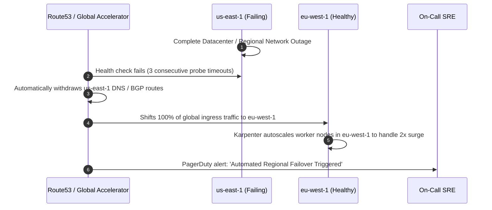

# 🌍 Multi-Region Active-Active Distributed Architecture

> **Senior/Staff Interview Scope**: Designing zero-downtime multi-region active-active architectures, global traffic steering (Anycast BGP vs Route53 Geolocation / Latency routing), cross-region data replication, and write-conflict resolution (LWW vs CRDTs vs CockroachDB / Google Cloud Spanner).

---

## 1. High-Level Multi-Region Active-Active Architecture

```mermaid
flowchart TD
    Client["Global Users (Americas / EMEA / APAC)"] --> Route53["Global Traffic Steering<br/>(Route53 Latency / Geolocation + Health Checks)"]

    subgraph Region_US_East["Region 1: AWS us-east-1 (Active)"]
        ALB1["Application Load Balancer"]
        EKS1["EKS Microservice Cluster"]
        Cache1["Redis Cluster (Local Read/Write)"]
        DB1["DynamoDB Global Table / Aurora Global (us-east-1)"]
        
        ALB1 --> EKS1
        EKS1 --> Cache1
        EKS1 --> DB1
    end

    subgraph Region_EU_West["Region 2: AWS eu-west-1 (Active)"]
        ALB2["Application Load Balancer"]
        EKS2["EKS Microservice Cluster"]
        Cache2["Redis Cluster (Local Read/Write)"]
        DB2["DynamoDB Global Table / Aurora Global (eu-west-1)"]
        
        ALB2 --> EKS2
        EKS2 --> Cache2
        EKS2 --> DB2
    end

    Route53 -->|Low-Latency Route| ALB1
    Route53 -->|Low-Latency Route| ALB2

    subgraph Global_Replication_Backbone["Cross-Region Replication Backbone (AWS Transit Gateway / Direct Connect)"]
        DB1 <-->|Async Multi-Master Replication (Sub-second lag)| DB2
    end
```

---

## 2. Traffic Steering: Route53 DNS vs Anycast IP Routing

| Feature | Route53 Geolocation / Latency Routing | Anycast BGP Routing (AWS Global Accelerator / Cloudflare) |
|---|---|---|
| **Routing Layer** | Layer 7 (DNS Resolution) | Layer 3/4 (BGP Anycast IP announcement) |
| **Failover Speed** | Dependent on client DNS caching & TTL (30s–5 minutes) | **Instant (< 10 seconds)**; BGP automatically withdraws route |
| **Connection Migration** | Client must re-resolve DNS name | Anycast edge terminates TCP/TLS closer to user; routes over AWS backbone |
| **Cost** | Minimal ($0.40/million queries) | Higher (Fixed hourly fee + data transfer) |

---

## 3. Data Replication & Conflict Resolution Strategies

When writes occur concurrently in `us-east-1` and `eu-west-1` on the same record:

1. **Last-Write-Wins (LWW) with Physical Clocks**:
   - Compares timestamps. The write with the highest NTP timestamp overwrites previous writes.
   - **Risk**: Clock drift / skew across servers can silently drop valid writes.
2. **Conflict-Free Replicated Data Types (CRDTs)**:
   - Mathematically convergent data structures (e.g. PN-Counters, Observed-Removed Sets).
   - Guarantees eventual consistency regardless of network packet reordering or replication delays.
3. **TrueTime & Spanner / CockroachDB (External Consistency)**:
   - Google Cloud Spanner uses atomic clocks and GPS receivers (**TrueTime API**) to guarantee strict serializable transactions globally without locking across regions.

---

## 4. Disaster Recovery Failover Sequence (Handling Complete Regional Outage)


