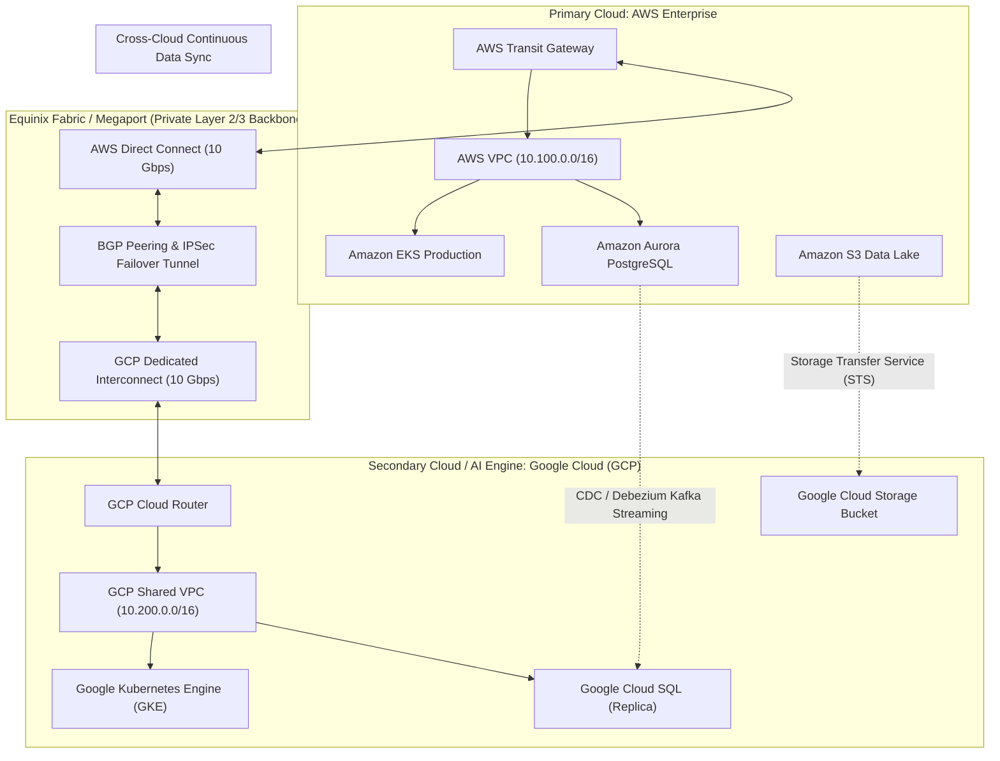

# ☁️ Multi-Cloud Architecture & Disaster Recovery (AWS + GCP)

> **Senior/Staff Interview Scope**: Designing cross-cloud resilience between AWS and GCP (excluding Azure), dedicated interconnects (AWS Direct Connect + GCP Cloud Interconnect via Equinix/Megaport), zero-trust cross-cloud identity federation, and hybrid data synchronization.

---

## 1. AWS + GCP Hybrid Architecture & Interconnect Backbone

---

## 2. Multi-Cloud DR Tiers & Tradeoffs

| DR Pattern | RPO (Data Loss) | RTO (Downtime) | Cost Multiplier | Operational Complexity |
|---|---|---|---|---|
| **Backup & Restore (Cold DR)** | Hours (Snapshot interval) | 4–12 Hours | $1.05\times$ | Low |
| **Pilot Light (Warm Standby)** | Minutes (Continuous DB replication) | 15–30 Minutes | $1.3\times$ | Moderate |
| **Warm Standby (Active-Passive)** | Sub-second | 2–5 Minutes | $1.6\times$ | High |
| **Multi-Cloud Active-Active** | Zero (Synchronous) to ms | **Zero (Instant failover)** | $2.2\times$ | Very High |

---

## 3. Cross-Cloud Identity & Secrets Management

Avoid static AWS access keys stored in GCP or vice versa:
1. **GCP Workload Identity Federation**:
   - GKE pods authenticate to AWS STS using OIDC JSON Web Tokens (JWT) to assume an IAM Role in AWS without any stored credentials.
2. **HashiCorp Vault Multi-Cloud Secrets**:
   - Vault deployed across AWS and GCP cluster nodes with Raft storage replication.
   - Microservices in either cloud authenticate to Vault via native AWS IAM or GCP IAM auth methods.

---

## 4. Cross-Cloud Storage Replication

- **AWS S3 to GCP Cloud Storage**:
  - Use **GCP Storage Transfer Service (STS)** for continuous asynchronous synchronization.
  - Generates HMAC keys in AWS S3 and runs scheduled micro-batch delta replication every 5 minutes.
  - Ensures disaster recovery datasets remain hot in GCP with near-zero RPO.
