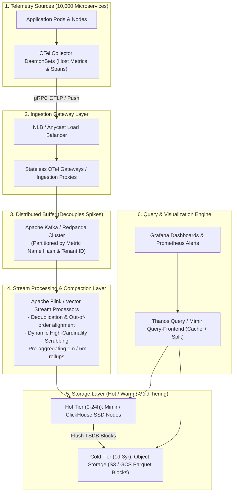

# 🏗️ System Design: High-Scale Telemetry Platform (10M Metrics/Sec)

> **Interview Prompt**:  
> *"Design a centralized observability and telemetry ingestion platform capable of handling 10 Million metric samples per second, 1 Million log events per second, and distributed tracing across 10,000 microservices with sub-second query latency for SRE dashboards."*

---

## 1. Scale & Back-of-the-Envelope Estimation

- **Ingestion Scale**:
  - $10,000,000\text{ metric samples/sec}$.
  - Each sample $\approx 16\text{ bytes}$ (Timestamp 8B + Float64 Value 8B + Metric ID hash).
  - Network Ingress: $10\text{M} \times 16\text{B} = 160\text{ MB/sec} = 1.28\text{ Gbps}$.
  - Uncompressed Daily Volume: $160\text{ MB/s} \times 86400\text{ s} \approx 13.8\text{ TB/day}$.
  - After TSDB Gorilla / Snappy compression ($\approx 2\text{ bytes/sample}$): $\approx 1.7\text{ TB/day}$.
- **SLA / SLO**:
  - Ingestion Availability: $99.99\%$ (Data loss $< 0.001\%$).
  - P99 Dashboard Query Latency: $< 500\text{ms}$ for 1-hour ranges, $< 2\text{s}$ for 30-day ranges.

---

## 2. End-to-End System Architecture

---

## 3. Deep-Dive Design Decisions

### 1. Partitioning & Sharding Strategy in Kafka
- **Partition Key**: `hash(tenant_id + metric_name)`.
- **Rationale**: Guarantees that all time-series samples for a given metric land in the same Kafka partition, ensuring strict temporal order for Flink stream processing without cross-partition shuffles.

### 2. Stream Processing with Apache Flink
- Computes **sliding-window rollups** (1-minute and 5-minute averages, P50, P95, P99 quantiles) directly in-stream before writing to storage.
- When dashboards query a 30-day view, they query pre-aggregated rollups instead of scanning 25 billion raw data points.

### 3. Query Splitting & Caching (Mimir Query Frontend)
- A PromQL query for `[30d]` is split into 30 parallel 1-day sub-queries.
- Sub-query results are cached in **Redis / Memcached**. Subsequent dashboard reloads return instant cache hits.
