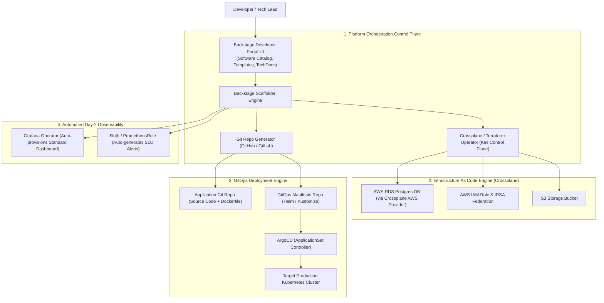

# 🏗️ System Design: Internal Developer Platform (IDP) at Scale

> **Interview Prompt**:  
> *"Design a self-service Internal Developer Platform (IDP) for an engineering organization of 2,000 developers across 300 microservice teams. The platform must allow developers to scaffold a new production-ready microservice (with CI/CD, K8s manifests, IAM roles, DB provisioning, and Grafana dashboards) in under 5 minutes without opening tickets to DevOps."*

---

## 1. High-Scale IDP Architecture



---

## 2. Core Architectural Components

### 1. Developer Portal: Spotify Backstage
- **Software Catalog**: Central registry of all microservices, ownership, API specs (OpenAPI/gRPC), and operational health.
- **Software Templates (Golden Paths)**: Standardized blueprints (e.g. `Go Microservice with Postgres & Kafka`, `Python Fast-API ML Service`).

### 2. Infrastructure as Code: Crossplane / Terraform Cloud
- Developers do not write raw Terraform or IAM policies.
- Developers declare a high-level **Composite Resource Definition (XRD)** in Kubernetes:
  ```yaml
  apiVersion: platform.company.com/v1alpha1
  kind: AppDatabase
  metadata:
    name: payments-db
  spec:
    engine: postgres
    version: "16"
    size: medium # Mapped by platform team to db.r6g.xlarge with automated backups & multi-AZ
  ```

### 3. GitOps Automation with ArgoCD ApplicationSets
- Uses **Git Generator** to automatically discover new microservice folders in the GitOps repo and provision corresponding ArgoCD applications without manual configuration:
  ```yaml
  apiVersion: argoproj.io/v1alpha1
  kind: ApplicationSet
  metadata:
    name: microservices-appset
  spec:
    generators:
      - git:
          repoURL: https://github.com/my-org/gitops-manifests.git
          revision: HEAD
          directories:
            - path: services/*
  ```

---

## 3. Governance, Security & Policy-as-Code

- **Kyverno / OPA Gatekeeper**: Enforces organizational guardrails (e.g. non-root containers, mandatory memory limits, verified Cosign container signatures).
- **Cost Allocation**: Every resource provisioned by the IDP is automatically tagged with `cost-center: <team-id>` and `environment: prod` for FinOps attribution.
