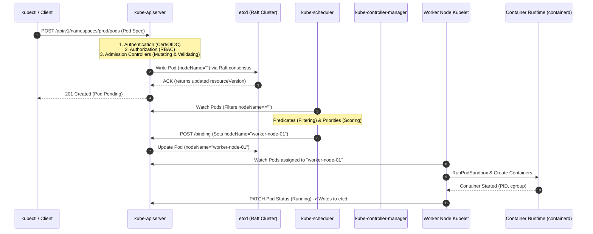

# ☸️ Kubernetes Deep Internals & Control Plane Mechanics

> **Senior/Staff Interview Scope**: Control plane reconciliation loops, etcd Raft consensus & write path, API Server optimistic concurrency (`resourceVersion`), Kubelet PLEG (Pod Lifecycle Event Generator), and custom scheduler extension algorithms.

---

## 1. Kubernetes End-to-End Control Plane Architecture

---

## 2. etcd Raft Consensus & Write Guarantees

- **The Raft Quorum**:
  - Requires a strict majority: $Q = \lfloor N/2 \rfloor + 1$ (e.g. 3 nodes can tolerate 1 failure; 5 nodes can tolerate 2 failures).
  - Every write goes to the **Raft Leader** $\rightarrow$ Leader appends to its WAL on disk $\rightarrow$ Proposes entry to all followers $\rightarrow$ Once majority ACKs, the entry is committed $\rightarrow$ Applied to the bbolt key-value database.
- **Why etcd Latency Destroys K8s Clusters**:
  - etcd writes must `fsync()` synchronously to disk.
  - If disk `fsync()` latency exceeds 10–20ms (e.g. slow EBS or I/O throttling), leader heartbeats time out, triggering non-stop leader elections and cluster-wide API server degradation.
  - **Best Practice**: etcd MUST run on dedicated local NVMe SSDs or high-IOPS storage (`io2` on AWS).

---

## 3. Optimistic Concurrency Control (`resourceVersion`)

Kubernetes does NOT use pessimistic locks. Instead, it uses **Optimistic Concurrency Control (OCC)**:
1. When a client reads a Pod, etcd returns the current `metadata.resourceVersion` (e.g. `10423`).
2. If two controllers attempt to update the same Pod simultaneously, the first write succeeds and increments the `resourceVersion` to `10424`.
3. The second write arrives with `resourceVersion=10423`. The API server rejects it immediately with **`409 Conflict: Operation cannot be fulfilled on pods ... the object has been modified`**.
4. The second controller must re-read the updated object and retry its reconciliation loop.

---

## 4. Kubelet PLEG (Pod Lifecycle Event Generator)

- **What is PLEG**:
  - The Kubelet background loop that queries the container runtime (`containerd`) every 1 second to compare the current container states against desired state.
- **The "PLEG is not healthy" Node NotReady Outage**:
  - If the container runtime hangs (e.g. kernel D-state deadlock on docker shim, or slow storage mount during container teardown), PLEG times out (> 3 minutes).
  - Kubelet marks the entire Node as `NotReady`, causing the control plane to evict all running pods from the node.
