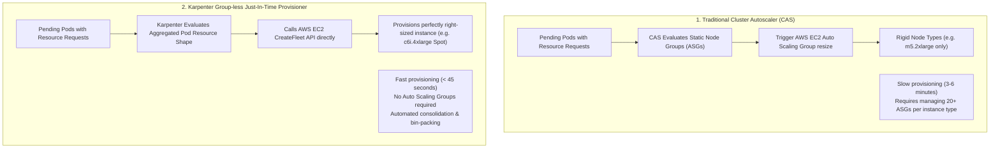

# ⚡ Karpenter vs Cluster Autoscaler & Cost-Effective Scheduling

> **Senior/Staff Interview Scope**: Node autoscaling architecture, Karpenter just-in-time provisioning vs Kubernetes Cluster Autoscaler (CAS) Auto Scaling Groups (ASGs), Spot instance orchestration, Pod Disruption Budgets (PDBs), and Topology Spread Constraints.

---

## 1. Karpenter vs Traditional Cluster Autoscaler (CAS)



| Dimension | Cluster Autoscaler (CAS) | Karpenter |
|---|---|---|
| **Underlying Abstraction** | Bound to cloud Auto Scaling Groups (ASGs) / Managed Node Groups | Group-less; directly provisions EC2 instances via `CreateFleet` |
| **Provisioning Latency** | 3–6 minutes | **30–45 seconds** |
| **Instance Selection** | Rigid (must create separate ASG per instance type and AZ) | Dynamic (evaluates 50+ EC2 instance types on the fly) |
| **Cost Consolidation** | Basic scale-down on low utilization | Continuous automated bin-packing & node consolidation |

---

## 2. Production Karpenter NodePool & EC2NodeClass

```yaml
apiVersion: karpenter.sh/v1beta1
kind: NodePool
metadata:
  name: general-compute
spec:
  template:
    spec:
      requirements:
        # Allow multi-architecture (ARM64 Graviton + x86_64)
        - key: kubernetes.io/arch
          operator: In
          values: ["arm64", "amd64"]
        - key: karpenter.k8s.aws/instance-family
          operator: In
          values: ["c6g", "c6i", "m6g", "m6i", "r6g", "r6i"]
        - key: karpenter.sh/capacity-type
          operator: In
          values: ["spot", "on-demand"] # Prefers Spot; falls back to On-Demand
      nodeClassRef:
        name: default-ec2-node-class
  disruption:
    consolidationPolicy: WhenUnderutilized # Automatically shrinks nodes when pods terminate
    expireAfter: 720h                      # 30-day node rotation for security patching
```

---

## 3. Defensive Scheduling: PDBs & Topology Spread Constraints

### 1. Pod Disruption Budget (PDB)
Guarantees minimum availability during voluntary disruptions (node draining, upgrades, Karpenter consolidation):
```yaml
apiVersion: policy/v1
kind: PodDisruptionBudget
metadata:
  name: payment-pdb
spec:
  minAvailable: 80% # At least 80% of replicas must stay running during node drain
  selector:
    matchLabels:
      app: payment
```

### 2. Topology Spread Constraint (Multi-AZ High Availability)
Evenly distributes pods across Availability Zones to survive an AWS AZ failure:
```yaml
spec:
  topologySpreadConstraints:
    - maxSkew: 1
      topologyKey: topology.kubernetes.io/zone
      whenUnsatisfiable: DoNotSchedule
      labelSelector:
        matchLabels:
          app: payment
```
