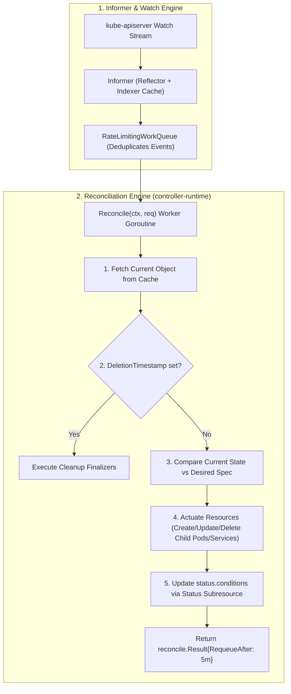

# 🛠️ Kubernetes Operator Development: CRDs & Controllers in Go

> **Senior/Staff Interview Scope**: Building production-grade Custom Resource Definitions (CRDs) and Controllers in Go using `controller-runtime` and `kubebuilder`, Informer cache patterns, event filtering with Predicates, and status subresource management.

---

## 1. The Kubernetes Operator Reconciliation Loop



---

## 2. Anatomy of a Custom Controller in Go

```go
package controllers

import (
	"context"
	"time"

	corev1 "k8s.io/api/core/v1"
	"k8s.io/apimachinery/pkg/api/errors"
	"k8s.io/apimachinery/pkg/runtime"
	ctrl "sigs.k8s.io/controller-runtime"
	"sigs.k8s.io/controller-runtime/pkg/client"
	"sigs.k8s.io/controller-runtime/pkg/log"

	platformv1 "company.com/api/v1"
)

// AppServiceReconciler reconciles an AppService object
type AppServiceReconciler struct {
	client.Client
	Scheme *runtime.Scheme
}

// Reconcile is the core control loop
func (r *AppServiceReconciler) Reconcile(ctx context.Context, req ctrl.Request) (ctrl.Result, error) {
	logger := log.FromContext(ctx)

	// 1. Fetch the Custom Resource from the cached client
	var appService platformv1.AppService
	if err := r.Get(ctx, req.NamespacedName, &appService); err != nil {
		if errors.IsNotFound(err) {
			// Object was deleted; ignore
			return ctrl.Result{}, nil
		}
		logger.Error(err, "unable to fetch AppService")
		return ctrl.Result{}, err
	}

	// 2. Business Logic: Ensure child deployment exists and matches desired replicas
	logger.Info("Reconciling AppService", "name", appService.Name, "replicas", appService.Spec.Replicas)

	// 3. Update Status subresource with current state
	appService.Status.ReadyReplicas = appService.Spec.Replicas
	if err := r.Status().Update(ctx, &appService); err != nil {
		logger.Error(err, "unable to update AppService status")
		return ctrl.Result{}, err
	}

	// 4. Return success and requeue periodically for drift detection
	return ctrl.Result{RequeueAfter: 10 * time.Minute}, nil
}

// SetupWithManager sets up the controller with the Manager.
func (r *AppServiceReconciler) SetupWithManager(mgr ctrl.Manager) error {
	return ctrl.NewControllerManagedBy(mgr).
		For(&platformv1.AppService{}).
		Owns(&corev1.Pod{}). // Re-trigger reconcile if child Pod changes
		Complete(r)
}
```

---

## 3. Best Practices for Operator Development

1. **Idempotency**: Every `Reconcile()` execution must be completely safe to execute multiple times without unintended side-effects.
2. **Never Make Raw API Server Calls**: Always read objects through the local Informer cache (`r.Get` reads from cache; `r.Update` writes to API Server).
3. **Use Finalizers for External Cleanup**: If deleting the Custom Resource requires tearing down an external AWS RDS database or S3 bucket, add a `finalizer` string (`platform.company.com/cleanup-rds`) and execute external teardown before removing the finalizer.
