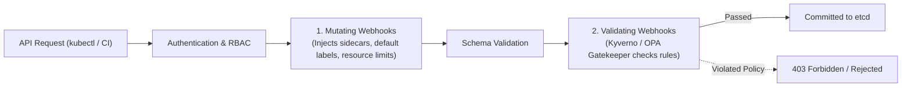

# 🛡️ Kubernetes Policy-as-Code & Multi-Tenant Governance

> **Senior/Staff Interview Scope**: Admission Controllers (Mutating vs Validating webhooks), Kyverno vs OPA Gatekeeper (Rego), Pod Security Standards (Privileged, Baseline, Restricted), and multi-tenant resource quotas.

---

## 1. Kubernetes Admission Controller Lifecycle



---

## 2. Kyverno vs OPA Gatekeeper

| Feature | Kyverno | OPA Gatekeeper |
|---|---|---|
| **Language** | Pure Kubernetes YAML (declarative) | Rego (Datalog-based query language) |
| **Mutation Capabilities** | Native YAML mutation (`mutate` rule) | Requires separate Mutation CRDs |
| **Generation Capabilities** | Can generate new resources (e.g. create default `NetworkPolicy` when new `Namespace` is created) | Not supported |
| **Ecosystem & Cross-Platform** | Kubernetes-only | Works across Kubernetes, Terraform, Envoy, API Gateways |
| **Learning Curve** | Very low (5 minutes for K8s engineers) | High (requires mastering Rego syntax) |

---

## 3. Essential Production Policy Rules

### 1. Enforce Non-Root Execution & Read-Only Root Filesystem (Kyverno)
```yaml
apiVersion: kyverno.io/v1
kind: ClusterPolicy
metadata:
  name: enforce-pod-security-restricted
spec:
  validationFailureAction: Enforce
  rules:
    - name: require-run-as-non-root
      match:
        any:
          - resources:
              kinds: ["Pod"]
      validate:
        message: "Containers must run as non-root with readOnlyRootFilesystem enabled."
        pattern:
          spec:
            securityContext:
              runAsNonRoot: true
            containers:
              - securityContext:
                  readOnlyRootFilesystem: true
                  allowPrivilegeEscalation: false
```

### 2. Auto-Inject Default Resource Requests/Limits (Mutating Policy)
```yaml
apiVersion: kyverno.io/v1
kind: ClusterPolicy
metadata:
  name: mutate-default-resources
spec:
  rules:
    - name: set-default-limits
      match:
        resources:
          kinds: ["Pod"]
      mutate:
        patchStrategicMerge:
          spec:
            containers:
              - (name): "?*"
                resources:
                  requests:
                    +(cpu): "100m"
                    +(memory): "128Mi"
                  limits:
                    +(memory): "512Mi"
```
