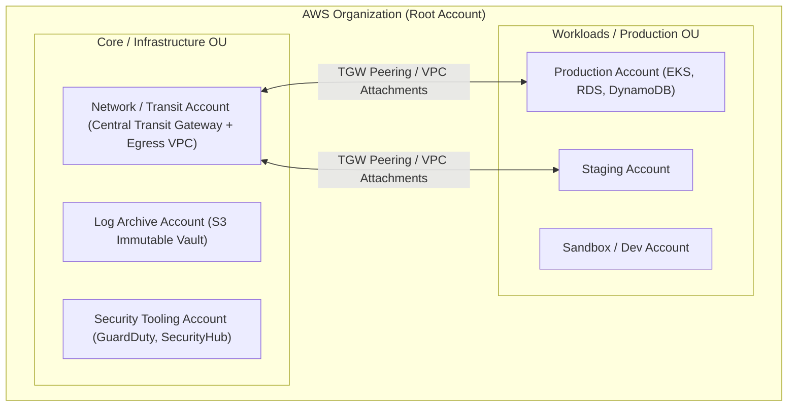

# ☁️ AWS Enterprise Deep Dive: Landing Zones, TGW, PrivateLink & IAM ABAC

> **Senior/Staff Interview Scope**: AWS Multi-Account architecture (Control Tower & Organizations), Transit Gateway (TGW) route domain isolation, VPC Endpoints & PrivateLink architecture, AWS KMS envelope encryption, and Attribute-Based Access Control (ABAC) in IAM.

---

## 1. Multi-Account AWS Landing Zone Architecture



---

## 2. Transit Gateway Route Table Segmentation

To isolate environments at the network layer without expensive VPC peering mesh ($O(N^2)$ connections):
1. **Prod Route Table**: Associated with Production VPCs; can only route to Production VPCs, Shared Services, and Central Egress.
2. **Non-Prod Route Table**: Associated with Staging/Dev VPCs; completely isolated from Prod VPCs.
3. **Egress Route Table**: Routes outbound 0.0.0.0/0 traffic through centralized AWS Network Firewalls and NAT Gateways, reducing NAT gateway costs across 50+ accounts.

---

## 3. AWS PrivateLink & VPC Endpoints (Zero Internet Traversal)

- **Interface Endpoints**:
  - Injects an Elastic Network Interface (ENI) with a private IP directly into your subnet for AWS services (ECR, STS, S3, Secrets Manager, Bedrock).
  - Keeps traffic entirely within the AWS global private network backbone.
- **Gateway Endpoints (S3 & DynamoDB)**:
  - Free route-table entries for Amazon S3 and DynamoDB; avoids NAT Gateway data processing charges ($0.045/GB saved).

---

## 4. Attribute-Based Access Control (ABAC) with IAM Tags

Instead of creating hundreds of individual IAM policies per team, use **Tag-Based ABAC**:
```json
{
  "Version": "2012-10-17",
  "Statement": [
    {
      "Effect": "Allow",
      "Action": ["ec2:StartInstances", "ec2:StopInstances", "ec2:RebootInstances"],
      "Resource": "arn:aws:ec2:*:*:instance/*",
      "Condition": {
        "StringEquals": {
          "aws:ResourceTag/Project": "${aws:PrincipalTag/Project}",
          "aws:ResourceTag/CostCenter": "${aws:PrincipalTag/CostCenter}"
        }
      }
    }
  ]
}
```
*Developers can only start/stop EC2 instances if the instance's `Project` and `CostCenter` tags match their own federated session tags.*
