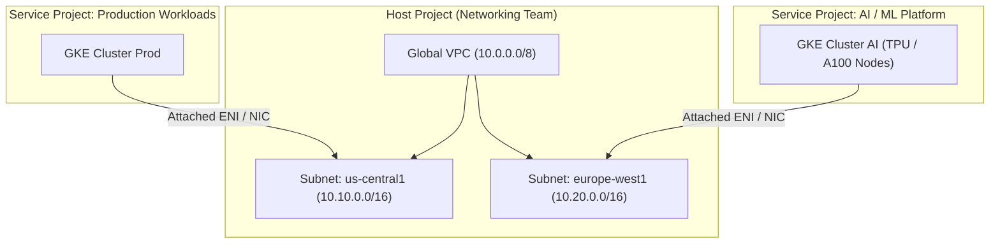

# 🌐 Google Cloud (GCP) Essentials for AWS Architects

> **Senior/Staff Interview Scope**: Mapping AWS mental models to Google Cloud Platform (GCP), GCP Shared VPC, VPC Service Controls (data exfiltration defense), GKE vs EKS architectural differences, and GCP Cloud Spanner / BigQuery.

---

## 1. AWS vs GCP Core Concept Mapping Matrix

| AWS Concept | GCP Equivalent | Key Architectural Difference |
|---|---|---|
| **AWS Account** | **GCP Project** | GCP uses hierarchical Folders & Organization under a single master billing account |
| **VPC (Regional)** | **VPC (Global)** | GCP VPCs are **global by default**; subnets are regional. No VPC peering needed across regions! |
| **Transit Gateway (TGW)** | **Shared VPC + Cloud Router** | Host project owns the network; Service projects attach their compute/GKE to shared subnets |
| **IAM Role & AssumeRole** | **Service Account & Impersonation** | Service accounts are resources AND identities; bound to roles via Cloud IAM bindings |
| **EKS (Elastic K8s)** | **GKE (Google K8s Engine)** | GKE has built-in auto-repair, auto-upgrade, integrated GCFS, and Autopilot mode |
| **AWS PrivateLink** | **Private Service Connect (PSC)** | Connects consumer VPCs to producer services via private IP endpoint without peering |
| **S3** | **Cloud Storage (GCS)** | Global bucket namespace with automatic dual-region and multi-region replication options |

---

## 2. GCP Shared VPC Architecture

---

## 3. VPC Service Controls (VPC-SC)

- **What Problem It Solves**: Prevents data exfiltration. Even if an IAM credential / service account key is stolen, an attacker cannot copy data from a Cloud Storage bucket or BigQuery dataset to an external unauthorized GCP project.
- **Service Perimeter**: Creates a cryptographic perimeter around Google API endpoints (`storage.googleapis.com`, `bigquery.googleapis.com`) enforcing that API calls must originate from within authorized corporate IP networks and authorized VPCs.

---

## 4. GKE vs EKS: What Interviewers Want to Hear
1. **Control Plane Management**: GKE control plane is fully managed and optimized by Google; node auto-upgrades and auto-repair are first-class.
2. **Datapath Optimization**: GKE uses Google's Andromeda SDN and native Datapath V2 (powered by Cilium eBPF).
3. **Workload Identity**: GKE Workload Identity maps K8s service accounts directly to GCP IAM service accounts natively via metadata server interception.
