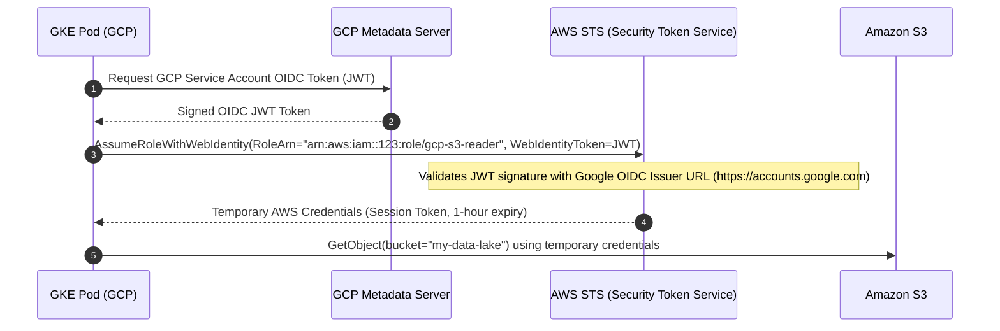

# 🔒 Multi-Cloud Interconnect, Security & Zero-Trust IAM

> **Senior/Staff Interview Scope**: High-speed dedicated cross-cloud connectivity, BGP dynamic routing, MTU alignment across AWS Direct Connect and GCP Cloud Interconnect, HashiCorp Vault multi-cloud secrets replication, and OIDC Workload Identity Federation.

---

## 1. High-Performance Cross-Cloud Interconnect Pipeline

```mermaid
flowchart LR
    subgraph AWS_Side["AWS Cloud (us-east-1)"]
        AWS_VPC["AWS VPC (10.10.0.0/16)"]
        TGW["Transit Gateway"]
        DX_GW["Direct Connect Gateway"]
        AWS_VPC --> TGW --> DX_GW
    end

    subgraph Colocation_Fabric["Colocation Fabric (Equinix Fabric / Megaport)"]
        AWS_VLAN["AWS Direct Connect Cross-Connect"]
        GCP_VLAN["GCP Partner Interconnect VLAN Attachment"]
        BGP_Session["eBGP Peering Session (ASN 64512 <-> ASN 64513)"]
        AWS_VLAN <--> BGP_Session <--> GCP_VLAN
    end

    subgraph GCP_Side["GCP Cloud (us-central1)"]
        CloudRouter["Cloud Router (BGP Dynamic Routing)"]
        GCP_VPC["GCP Shared VPC (10.20.0.0/16)"]
        CloudRouter --> GCP_VPC
    end

    DX_GW <--> AWS_VLAN
    GCP_VLAN <--> CloudRouter
```

---

## 2. Dynamic Routing & BGP Failover

1. **Primary Route**: Dedicated 10 Gbps Direct Connect & Interconnect with eBGP advertisements.
2. **Secondary Backup Route**: Automated IPSec VPN tunnel over the public internet with lower BGP Multi-Exit Discriminator (MED) / higher AS-Path prepend.
3. **MTU Alignment**:
   - Standard Jumbo Frames (9000 bytes) on Direct Connect.
   - GCP Partner Interconnect supports up to 1440–1500 bytes (or 8896 bytes if configured). MTU must be explicitly matched or MSS clamped to prevent packet fragmentation black holes.

---

## 3. Zero-Trust Identity Federation (GCP to AWS STS)

A GKE application pod in GCP calls Amazon S3 without any AWS IAM access keys:

