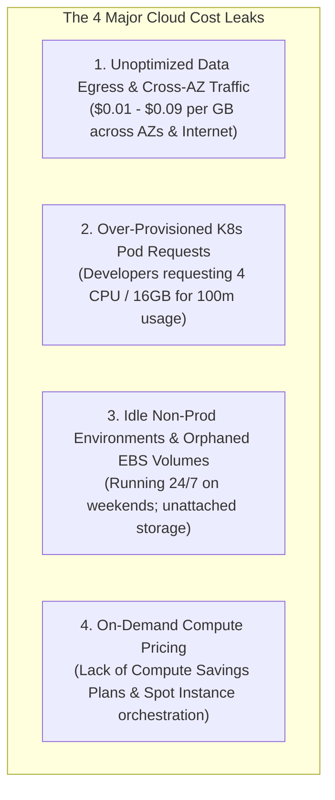

# 💰 FinOps & Cloud Cost Optimization at Scale

> **Senior/Staff Interview Scope**: Cloud cost reduction strategies, data egress architecture, AWS Savings Plans vs Reserved Instances vs GCP Committed Use Discounts (CUDs), FinOps unit economics, and automated idle resource reclamation.

---

## 1. The 4 Major Cloud Cost Leaks in Enterprise Infrastructure



---

## 2. Eliminating Data Egress & Inter-AZ Costs

1. **Cross-AZ Network Charges**:
   - AWS charges **$0.01 / GB in each direction** ($0.02 / GB total) for traffic crossing Availability Zones.
   - **Fix**: Configure **Topology-Aware Routing** in Kubernetes:
     ```yaml
     apiVersion: v1
     kind: Service
     metadata:
       name: internal-cache
       annotations:
         service.kubernetes.io/topology-mode: Auto # Routes traffic to pods in the SAME AZ
     ```
2. **NAT Gateway Data Processing Costs**:
   - NAT Gateway costs $0.045 / GB processed.
   - **Fix**: Use Gateway VPC Endpoints for S3 and DynamoDB (free) and Interface VPC Endpoints for ECR/CloudWatch.

---

## 3. Compute Savings Plans vs Spot Orchestration

| Pricing Model | Commitment | Discount % | Flexibility |
|---|---|---|---|
| **On-Demand** | None | 0% | Maximum |
| **Compute Savings Plans** | 1 or 3 Years ($/hour commit) | 40% – 66% | High (Applies automatically across EC2, Fargate, Lambda anywhere) |
| **EC2 Instance Savings Plans** | 1 or 3 Years | 50% – 72% | Low (Locked to specific instance family & region) |
| **AWS Spot / GCP Preemptible** | None (2-minute interrupt warning) | **60% – 90%** | Requires fault-tolerant workloads & Karpenter |

---

## 4. Kubernetes Right-Sizing & FinOps Attribution (Kubecost / OpenCost)

- **VPA (Vertical Pod Autoscaler)**:
  - Runs in `Off` mode for recommendation or `Auto` mode to dynamically adjust pod requests based on 99th percentile historical usage.
- **FinOps Unit Economics**:
  - Track **Cost per 1,000 API Requests** or **Cost per Active User** rather than just total cloud spend.
  - Generates automated weekly Slack notifications to microservice owners with their service's cost-efficiency grade.
