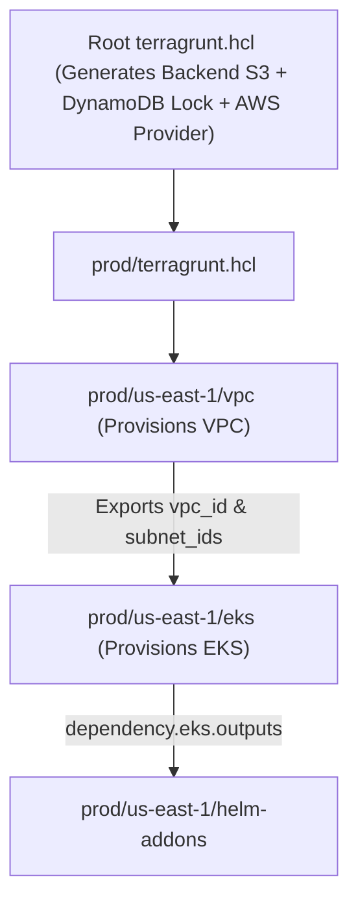

# 🏗️ Production IaC: Terragrunt & Terraform at Scale

> **Senior/Staff Interview Scope**: Structuring multi-account multi-region IaC repositories, Terragrunt DRY architecture (`generate`, `include`, `dependency`), remote state locking (DynamoDB / GCS object lock), custom provider writing, and zero-downtime refactoring (`terraform state mv` / `import` blocks).

---

## 1. Enterprise Terragrunt Repository Architecture

```
live/
├── terragrunt.hcl                  # Root config: Generates S3 backend & AWS provider
├── _envcommon/                     # Reusable environment blueprints
│   ├── vpc.hcl
│   └── eks-cluster.hcl
├── prod/
│   ├── env.hcl                     # account_id = "111111111111", env = "prod"
│   ├── us-east-1/
│   │   ├── vpc/
│   │   │   └── terragrunt.hcl      # Includes _envcommon/vpc.hcl with prod CIDR
│   │   └── eks/
│   │       └── terragrunt.hcl      # dependency.vpc.outputs.vpc_id
│   └── eu-west-1/
└── staging/
```



---

## 2. Root `terragrunt.hcl` DRY Configuration

```hcl
# Automatically generates S3 remote state bucket and DynamoDB locking table
remote_state {
  backend = "s3"
  generate = {
    path      = "backend.tf"
    if_exists = "overwrite_terragrunt"
  }
  config = {
    bucket         = "myorg-terraform-state-${local.account_id}-${local.aws_region}"
    key            = "${path_relative_to_include()}/terraform.tfstate"
    region         = local.aws_region
    encrypt        = true
    dynamodb_table = "terraform-locks"
  }
}

# Automatically generates AWS Provider block with assumed IAM role per account
generate "provider" {
  path      = "provider.tf"
  if_exists = "overwrite_terragrunt"
  contents  = <<EOF
provider "aws" {
  region = "${local.aws_region}"
  assume_role {
    role_arn = "arn:aws:iam::${local.account_id}:role/TerraformDeploymentRole"
  }
  default_tags {
    tags = {
      Environment = "${local.env}"
      ManagedBy   = "Terragrunt"
    }
  }
}
EOF
}
```

---

## 3. Zero-Downtime Terraform Refactoring (`moved` & `import` Blocks)

When refactoring monolithic modules into sub-modules, raw renames cause Terraform to attempt to **destroy and re-create** live production databases.

- **The `moved` Block (Native State Migration)**:
  ```hcl
  # Zero downtime: Updates state without modifying real cloud resources
  moved {
    from = aws_instance.web
    to   = module.compute.aws_instance.web[0]
  }
  ```
- **The `import` Block (Declarative Resource Onboarding)**:
  ```hcl
  import {
    to = aws_s3_bucket.legacy_data
    id = "my-pre-existing-s3-bucket-name"
  }
  ```
