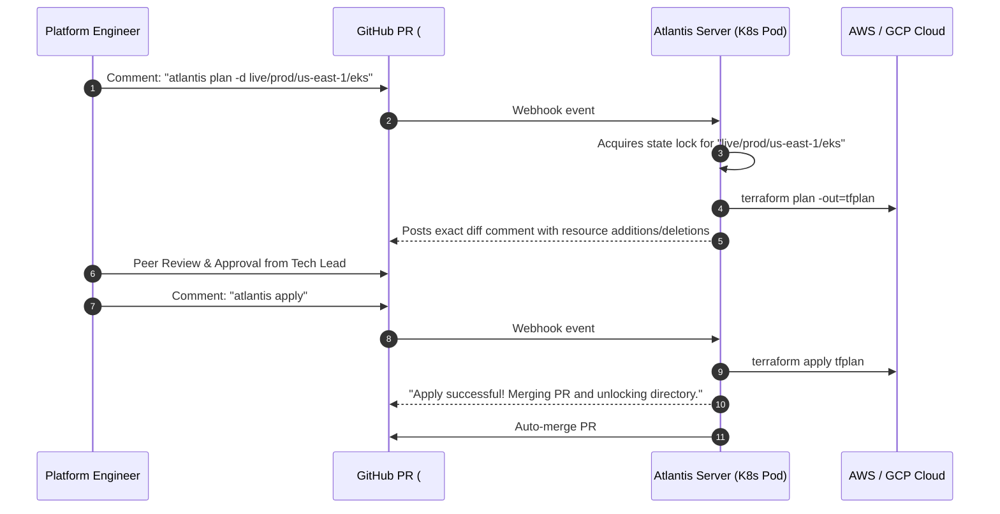

# 🔄 IaC Drift Detection & Atlantis GitOps Automation

> **Senior/Staff Interview Scope**: Terraform PR workflows with Atlantis / Spacelift, plan file validation, automated state locking during PR reviews, scheduled drift detection cron pipelines, and automated Slack alerting for out-of-band console changes.

---

## 1. Atlantis GitOps Pull-Request Workflow



---

## 2. Automated Scheduled Drift Detection

Out-of-band manual changes made in the AWS Console cause silent failures during the next emergency deployment.

### Automated Drift Pipeline (GitHub Actions Cron / Scheduled Task)
```yaml
name: Scheduled IaC Drift Detection
on:
  schedule:
    - cron: "0 6 * * *" # Runs daily at 6:00 AM UTC
jobs:
  drift-check:
    runs-on: ubuntu-latest
    steps:
      - uses: actions/checkout@v4
      - name: Terragrunt Plan All (Detailed Exit Code)
        run: |
          terragrunt run-all plan -detailed-exitcode || exit_code=$?
          if [ $exit_code -eq 2 ]; then
            echo "DRIFT_DETECTED=true" >> $GITHUB_ENV
          fi
      - name: Alert SRE Slack Channel on Drift
        if: env.DRIFT_DETECTED == 'true'
        uses: slackapi/slack-github-action@v1.26.0
        with:
          payload: |
            {"text": "🚨 CRITICAL: Terraform State Drift detected in Production environment! Investigate immediately."}
```
*Note: `terraform plan -detailed-exitcode` returns exit code `2` if a diff/drift exists, `0` for clean, and `1` for execution error.*
