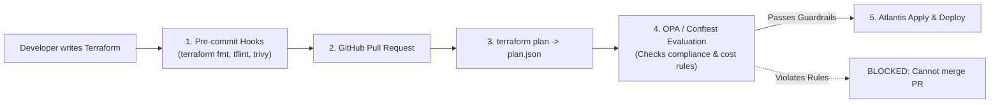

# 🛡️ Policy-as-Code in IaC: OPA Conftest, Checkov & Trivy

> **Senior/Staff Interview Scope**: Shifting security left in Infrastructure as Code, static analysis of Terraform plans, Open Policy Agent (OPA) / Conftest Rego policies, Checkov and Trivy static analysis gates in CI/CD.

---

## 1. Shift-Left IaC Security Architecture



---

## 2. Writing OPA / Conftest Rules for Terraform Plan JSON

### Rule 1: Disallow S3 Buckets Without Server-Side Encryption
```rego
package terraform.s3

# Deny creation of unencrypted S3 buckets
deny[msg] {
    resource := input.resource_changes[_]
    resource.type == "aws_s3_bucket"
    resource.change.actions[_] == "create"
    
    not resource.change.after.server_side_encryption_configuration
    
    msg := sprintf("S3 Bucket '%v' must have server_side_encryption_configuration enabled!", [resource.address])
}
```

### Rule 2: Enforce Mandatory Production Resource Tags
```rego
package terraform.tags

mandatory_tags := ["Environment", "Owner", "CostCenter", "ManagedBy"]

deny[msg] {
    resource := input.resource_changes[_]
    resource.change.actions[_] == "create"
    tags := resource.change.after.tags
    
    missing_tags := [tag | tag := mandatory_tags[_]; not tags[tag]]
    count(missing_tags) > 0
    
    msg := sprintf("Resource '%v' is missing mandatory tags: %v", [resource.address, missing_tags])
}
```

---

## 3. Running Static Scans in CI Pipelines

```bash
# Convert terraform binary plan to JSON for OPA evaluation
terraform show -json tfplan.binary > tfplan.json

# Evaluate OPA Conftest policies
conftest test tfplan.json --policy policies/

# Run Checkov security scanner with CVE severity threshold
checkov -f tfplan.json --framework terraform_plan --severity HIGH,CRITICAL
```
