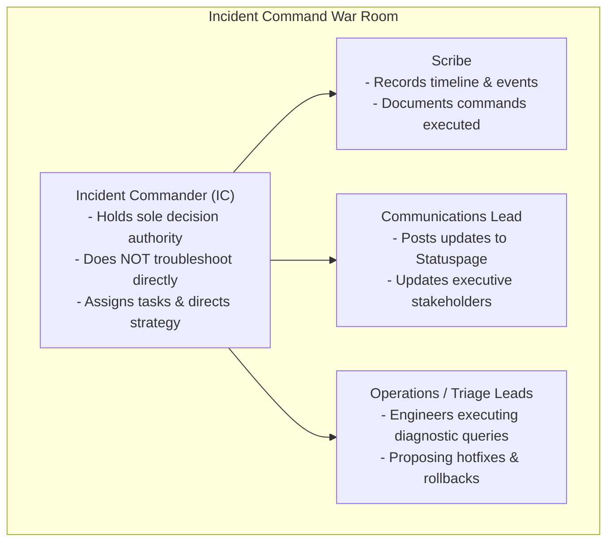

# 🚨 Incident Commander & War Room Operations Playbook

> **Senior/Staff Interview Scope**: Incident Command System (ICS), war-room roles (Commander, Scribe, Communications Lead, Operations Lead), blast-radius containment, blameless post-mortem lifecycle, and corrective action item tracking.

---

## 1. Incident Command Roles & Responsibilities

---

## 2. Incident Communication Cadence

1. **First 5 Minutes**:
   - Declare incident severity (P0 / P1 / P2).
   - Spin up dedicated War Room call + `#inc-<date>-<service>` Slack channel.
2. **Every 15–20 Minutes (Stakeholder Broadcast)**:
   - Template:
     > **Status**: Investigating / Mitigating / Monitoring  
     > **Impact**: ~15% of checkout API requests failing in `us-east-1`.  
     > **Current Action**: Team is rolling back release v2.4.1 to v2.4.0.  
     > **Next Update**: 14:30 UTC.

---

## 3. The Blameless Post-Mortem Structure

1. **Incident Summary**: High-level overview of customer impact, revenue loss, and duration.
2. **Timeline of Events (UTC)**: Millisecond-accurate chronology from first metric anomaly to resolution.
3. **5 Whys Root Cause Analysis**: Drilling down past the surface symptom to systemic organizational/architectural causes.
4. **What Went Well / Where We Got Lucky / What Went Poorly**.
5. **Action Items (Corrective & Preventative)**:
   - Every action item must have a **Single Directly Responsible Individual (DRI)** and a strict **Jira ticket deadline**.
