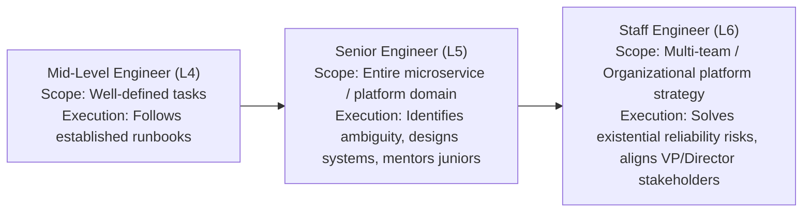

# 🎯 Senior vs Staff DevOps / SRE / Platform Engineer Evaluation Rubric

> **Senior/Staff Interview Scope**: How hiring committees at Tier-1 / MAANG companies evaluate candidates with 6.5+ years of experience. Understanding the distinction between Mid-Level (L4/IC4), Senior (L5/IC5), and Staff (L6/IC6).

---

## 1. Level Competency Matrix

| Evaluation Dimension | Mid-Level (L4) | Senior Engineer (L5 - Target) | Staff Engineer (L6 - Stretch) |
|---|---|---|---|
| **Scope of Impact** | Single service or sprint backlog | Entire platform domain / multi-region system | Org-wide infrastructure strategy across 500+ engineers |
| **Handling Ambiguity** | Needs detailed specifications | Takes high-level goals ("reduce P99 latency") and scopes milestones independently | Anticipates architectural failure modes 1–2 years in advance |
| **Troubleshooting Depth** | Basic tool usage (`top`, `kubectl logs`) | Deep kernel/networking profiling (`strace`, `perf`, `eBPF`, packet drops) | Redesigns platform architecture to eliminate entire classes of failure |
| **System Design** | Assembles standard components | Designs multi-region active-active architectures with deep understanding of tradeoffs | Sets technical vision for multi-cloud, FinOps, and developer productivity |
| **Leadership & Culture** | Individual contributor | Incident Commander for P0 outages; mentors junior/mid-level engineers | Drives cross-org consensus across product, security, and SRE executives |

---

## 2. Key Verbal Signals in Senior/Staff Interviews

1. **Use "I" for actions, "We" for team outcomes**:
   - Explicitly articulate what **you personally decided, implemented, or led**, while crediting the team for collaborative success.
2. **Quantify Business & Technical Impact**:
   - Bad: *"We made the deployments faster and improved reliability."*
   - Good: *"I redesigned our CI/CD caching with BuildKit and Dagger, reducing build times from 45 minutes to 4.2 minutes across 600 daily builds, saving 400 engineering hours/month and eliminating $18,000/month in CI compute spend."*
3. **Show Architectural Empathy**:
   - Acknowledge that no architecture is perfect. Always discuss **tradeoffs, edge cases, and future scale bottlenecks**.
