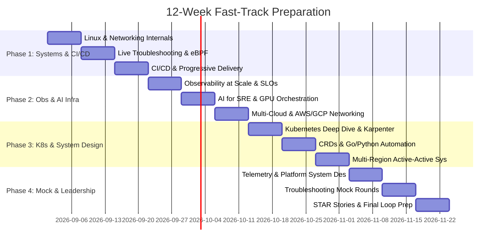

# ⚡ 3-Month Fast-Track Preparation Schedule (12 Weeks)

> **Commitment**: ~20 hours / week (e.g., 2.5 hours on weekdays, 4 hours on Saturday & Sunday).  
> **Target**: Rapid interview readiness for Senior DevOps / SRE / Platform Engineer roles.

---

## 🗓️ 12-Week Sprint Calendar

---

## 📋 Weekly Breakdown

### Week 1: Linux Kernel, Memory, CPU & I/O
- **Study**: cgroups v2, Page Cache, Dirty memory flush, Swap, OOM killer scoring (`oom_score_adj`), CFS CPU bandwidth throttling.
- **Hands-on**: Simulate memory pressure, inspect `/proc/meminfo`, `/proc/sys/vm/*`, configure cgroup CPU/memory limits.
- **Deliverable**: Complete [01-linux-kernel-memory-cpu-io.md](../01-linux-systems-networking/01-linux-kernel-memory-cpu-io.md).

### Week 2: TCP/IP Stack & Live Linux Troubleshooting
- **Study**: TCP 3-way handshake, TCP states (`TIME_WAIT`, `CLOSE_WAIT`, `FIN_WAIT2`), SYN floods, epoll, socket buffers, DNS resolver chain.
- **Hands-on**: Practice with `ss -tan`, `tcpdump`, `strace -p <pid> -c -T`, `perf top`, `sysdig`.
- **Deliverable**: Solve [Scenario 1: High Load with Low CPU](../01-linux-systems-networking/scenarios/scenario-01-high-load-low-cpu.md) and [Scenario 2: Port Exhaustion](../01-linux-systems-networking/scenarios/scenario-02-mysterious-502-and-port-exhaustion.md).

### Week 3: Enterprise CI/CD & Progressive Delivery
- **Study**: Monorepo vs Multi-repo pipeline design, remote build caching (Dagger/Bazel), ephemeral PR environments (vCluster).
- **Hands-on**: Argo Rollouts canary release with automated Prometheus metric analysis and rollback trigger.
- **Deliverable**: Complete [02-progressive-delivery-canary-bluegreen.md](../02-enterprise-cicd-release-engineering/02-progressive-delivery-canary-bluegreen.md) & [03-supply-chain-security-devsecops.md](../02-enterprise-cicd-release-engineering/03-supply-chain-security-devsecops.md).

### Week 4: Observability, OpenTelemetry & SLO Engineering
- **Study**: OpenTelemetry Collector architecture, receivers/processors/exporters, tail-based sampling, Prometheus TSDB mechanics, Thanos vs Mimir.
- **Hands-on**: Formulate multi-window multi-burn-rate SLO alerts (1h / 6h / 3d burn rate calculations).
- **Deliverable**: Complete [01-opentelemetry-architecture-pipelines.md](../03-observability-telemetry-at-scale/01-opentelemetry-architecture-pipelines.md) & [05-slo-sli-error-budget-alerting.md](../03-observability-telemetry-at-scale/05-slo-sli-error-budget-alerting.md).

### Week 5: AI for SRE & AI/ML Platform Engineering
- **Study**: LLM-assisted incident triage & automated RCA, NVIDIA GPU Operator on K8s, MIG (Multi-Instance GPU), vLLM / Triton inference infra.
- **Hands-on**: Spot GPU interruption graceful draining, KEDA scale-to-zero model serving.
- **Deliverable**: Complete [01-aiops-llm-incident-triage-rca.md](../04-ai-for-sre-and-ai-platform-engineering/01-aiops-llm-incident-triage-rca.md) & [02-gpu-orchestration-kubernetes.md](../04-ai-for-sre-and-ai-platform-engineering/02-gpu-orchestration-kubernetes.md).

### Week 6: Multi-Cloud Architecture (AWS + GCP)
- **Study**: AWS Organizations, Transit Gateway, PrivateLink, IAM ABAC, GCP Shared VPC, Cloud Interconnect, cross-cloud secure mesh.
- **Hands-on**: FinOps data transfer cost audit, cross-cloud IAM federation with Workload Identity.
- **Deliverable**: Complete [01-aws-enterprise-architecture.md](../07-cloud-architecture-aws-gcp/01-aws-enterprise-architecture.md) & [02-gcp-for-aws-architects.md](../07-cloud-architecture-aws-gcp/02-gcp-for-aws-architects.md).

### Week 7: Kubernetes Internals & Platform Engineering
- **Study**: etcd Raft quorum & write path, API server optimistic concurrency, Kubelet PLEG, Cilium eBPF CNI routing vs kube-proxy iptables.
- **Hands-on**: Karpenter node provisioning vs Cluster Autoscaler, Pod Disruption Budgets, Topology Spread Constraints.
- **Deliverable**: Complete [01-k8s-internals-and-control-plane.md](../06-kubernetes-platform-engineering/01-k8s-internals-and-control-plane.md) & [03-karpenter-and-cluster-autoscaling.md](../06-kubernetes-platform-engineering/03-karpenter-and-cluster-autoscaling.md).

### Week 8: Custom K8s Operators & SRE Coding in Go/Python
- **Study**: Kubebuilder controller runtime, informers, listers, workqueues, Go concurrency (goroutines, channels, sync.WaitGroup, context).
- **Hands-on**: Write a custom pod watcher controller in Go and a high-performance log analyzer in Python.
- **Deliverable**: Implement [worker_pool.go](../09-systems-coding-and-automation/go/worker_pool.go) and [rate_limiter.py](../09-systems-coding-and-automation/leetcode-sre-patterns/rate_limiter.py).

### Week 9: Distributed Systems Design - Multi-Region Active-Active
- **Study**: 45-min system design interview formula, DynamoDB Global Tables, Aurora Multi-Region, CockroachDB/Spanner Raft groups, GeoDNS vs Anycast.
- **Hands-on**: Draw end-to-end multi-region failover architecture with conflict resolution.
- **Deliverable**: Complete [01-system-design-interview-framework.md](../05-distributed-systems-and-system-design/01-system-design-interview-framework.md) & [02-multi-region-active-active.md](../05-distributed-systems-and-system-design/02-multi-region-active-active.md).

### Week 10: Infrastructure System Design - Telemetry & Internal Developer Platform
- **Study**: Ingesting 10M metrics/sec (Kafka + Flink + Thanos/ClickHouse), designing a multi-tenant self-service platform (Backstage + ArgoCD + Kyverno).
- **Hands-on**: Practice sketching end-to-end platform design in under 30 minutes.
- **Deliverable**: Complete [04-design-high-scale-telemetry-platform.md](../05-distributed-systems-and-system-design/04-design-high-scale-telemetry-platform.md).

### Week 11: Production IaC, GitOps & Live Troubleshooting Simulations
- **Study**: Terragrunt DRY architecture, state locking, Atlantis PR workflow, Policy-as-Code (OPA/Conftest).
- **Hands-on**: 45-minute timed mock troubleshooting drills.
- **Deliverable**: Complete [01-terragrunt-and-terraform-at-scale.md](../08-iac-and-infrastructure-automation/01-terragrunt-and-terraform-at-scale.md).

### Week 12: Behavioral Leadership, Incident Management & Mock Interviews
- **Study**: 15 STAR stories tailored to Staff/Senior rubric (Impact, Blast Radius, Technical Conflict, Production Outage).
- **Hands-on**: Rehearse Incident Commander communication, live war-room management, and compensation negotiation strategies.
- **Deliverable**: Complete [01-star-incident-story-matrix.md](../10-behavioral-leadership-and-incident-management/01-star-incident-story-matrix.md).
