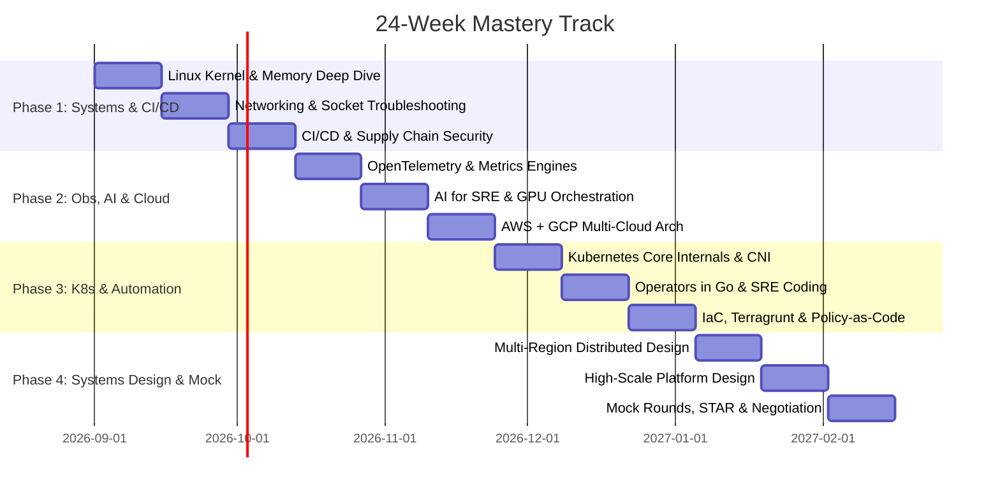

# 🎯 6-Month Mastery Track Schedule (24 Weeks)

> **Commitment**: ~10–12 hours / week (e.g., 1.5 hours/day on weekdays, 2.5 hours on weekends).  
> **Target**: Deep, unshakeable technical mastery across all 10 pillars for Tier-1 / MAANG Senior and Staff SRE / Platform Engineer loops.

---

## 🗓️ 24-Week Phased Plan

---

## 📚 2-Week Sprint Matrix

| Sprints | Weeks | Core Focus | Hands-On Milestone | Key Deliverables |
|---|:---:|---|---|---|
| **Sprint 1** | 1–2 | **Linux OS Internals & Kernel** | Memory pressure simulation, cgroups v2 resource limits, OOM killer analysis | [01-linux-kernel-memory-cpu-io.md](../01-linux-systems-networking/01-linux-kernel-memory-cpu-io.md) |
| **Sprint 2** | 3–4 | **TCP/IP, Networking & Debugging** | TCP state dumps (`ss -s`), packet capture inspection (`tcpdump`), `strace` syscall latency profiling | [02-networking-tcp-udp-dns-bgp.md](../01-linux-systems-networking/02-networking-tcp-udp-dns-bgp.md) |
| **Sprint 3** | 5–6 | **Enterprise CI/CD & DevSecOps** | Argo Rollouts canary deployment with automated metrics analysis; Cosign container signing | [02-progressive-delivery-canary-bluegreen.md](../02-enterprise-cicd-release-engineering/02-progressive-delivery-canary-bluegreen.md) |
| **Sprint 4** | 7–8 | **Observability & SLO Engineering** | OpenTelemetry Collector configuration, Thanos architecture, multi-window burn-rate SLO alerting | [01-opentelemetry-architecture-pipelines.md](../03-observability-telemetry-at-scale/01-opentelemetry-architecture-pipelines.md) |
| **Sprint 5** | 9–10 | **AI for SRE & AI Platform Infra** | Kubernetes NVIDIA GPU Operator setup, MIG partitioning, vLLM deployment, Spot GPU interruption handling | [02-gpu-orchestration-kubernetes.md](../04-ai-for-sre-and-ai-platform-engineering/02-gpu-orchestration-kubernetes.md) |
| **Sprint 6** | 11–12 | **AWS & GCP Cloud Architecture** | AWS Transit Gateway & PrivateLink, GCP Shared VPC, cross-cloud IAM Workload Identity federation | [01-aws-enterprise-architecture.md](../07-cloud-architecture-aws-gcp/01-aws-enterprise-architecture.md) |
| **Sprint 7** | 13–14 | **Kubernetes Internals & CNI** | etcd Raft quorum write tracing, Cilium eBPF packet routing vs kube-proxy iptables, Karpenter scaling | [01-k8s-internals-and-control-plane.md](../06-kubernetes-platform-engineering/01-k8s-internals-and-control-plane.md) |
| **Sprint 8** | 15–16 | **Custom Operators & Go/Python** | Build a custom CRD and Controller in Go using `controller-runtime` and `client-go`; Python log streaming parser | [worker_pool.go](../09-systems-coding-and-automation/go/worker_pool.go) |
| **Sprint 9** | 17–18 | **Production IaC & GitOps** | Terragrunt DRY multi-environment setup, drift detection automation with Atlantis, OPA/Conftest policy checks | [01-terragrunt-and-terraform-at-scale.md](../08-iac-and-infrastructure-automation/01-terragrunt-and-terraform-at-scale.md) |
| **Sprint 10** | 19–20 | **Multi-Region Distributed Design** | Design active-active multi-region systems, cross-region DB sync, conflict-free replicated data types (CRDT) | [02-multi-region-active-active.md](../05-distributed-systems-and-system-design/02-multi-region-active-active.md) |
| **Sprint 11** | 21–22 | **High-Scale Platform System Design** | Design 10M metrics/sec telemetry platform, internal developer platform with Backstage and ArgoCD | [04-design-high-scale-telemetry-platform.md](../05-distributed-systems-and-system-design/04-design-high-scale-telemetry-platform.md) |
| **Sprint 12** | 23–24 | **Mock Interviews & Staff Leadership** | 45-min live troubleshooting mock rounds, 15 STAR story rehearsals, executive presence & offer negotiation | [01-star-incident-story-matrix.md](../10-behavioral-leadership-and-incident-management/01-star-incident-story-matrix.md) |
